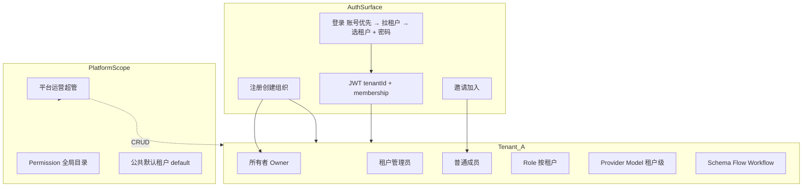
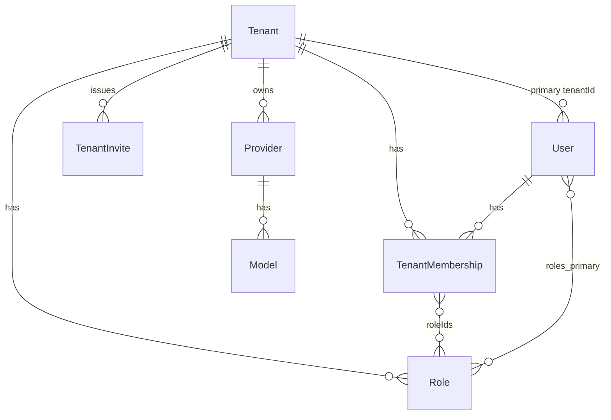

# 租户 · 注册 · 鉴权体系重设计

> **状态:** P1–P8 **已关闭**（P7：本地 Ethereal 冒烟通过；生产部署仍建议显式 SMTP_* / INVITE_LINK_BASE）  
> **日期:** 2026-09-05（查漏：P6 DailyCostMeter 按 tenant+user；P4 TenantDetailView；P7 smoke-smtp）  
> **范围:** `server/` · `shared/platform-shared` · `ua/` · `editor/` · `flow/` · `ai/` · `forum-admin/` · AI 模型中心 / getLLM  
> **相关:** [UA 权限 · BYOK · 设备](../ai/design/ua-permissions-byok-admin-device.md) · [服务双因子](../ai/design/service-dual-factor-access.md) · [模型架构](./model-architecture.md) · 现有 `costMeter` / `Quota`

---

## 0. 产品决断（已锁定）


| 决策    | 选择                                                        | 理由                                         |
| ----- | --------------------------------------------------------- | ------------------------------------------ |
| 租户是什么 | **组织/团队**（B2B），不是「一个注册用户」                                 | UA 已按租户管用户/角色；模型中心是租户共享配置                  |
| 自助注册  | **双路径**：① 创建组织（租户+所有者）② 凭邀请加入已有组织                         | 对应「租户注册 / 用户注册」；公共组件用 props 切换             |
| 平台超管  | **平台运营账号**（platform scope），与租户管理员分离                       | UA 创建/停用任意租户；租户管理员只管本租户                    |
| 用户归属  | **主租户** `User.tenantId` + **成员表** `TenantMembership`      | 数据上支持用户多租户；**切换仅发生在登录页**（见 P8）            |
| 登录选租户 | **账号优先**：先输入用户名 → 拉取可选租户 → 选择后输入密码登录                     | 用户不必背租户码；多租户时在登录侧完成选择                      |
| 租户切换  | **仅登录侧**；登录后工作台不做跨租户切换 UI                                 | `/api/tenants/switch` 保留能力，**非**主产品路径     |
| 租户 ID | **组织/应用租户**用 `Tenant._id`；**平台默认**业务 ID 固定哨兵 **`000000`**（`code=default` 文档仅元数据） | 存量数据已在 `000000`；禁止再迁到 ObjectId 造成分裂 |
| 论坛    | 仍 `source=forum`；挂 **独立应用租户 `code=forum`**                   | 论坛用户不得进平台业务 API                            |
| Chat  | **workflow-agent-chat**：注册固定 **`code=chat`**；**平台账号可登录**（按账号主租户解析，通常 `default`/`000000`）；chat 自注册账号走 `chat` | 登录代理平台账号体系；**禁止**因固定应用租户而改写 `User.tenantId` |


本设计文档是实施规格；未批准前不改运行时代码以外的「口头方案」。

---


## 1. 问题陈述（现状）

1. 公共 `[LoginView](../../shared/platform-shared/components/auth/LoginView.vue)` 只有「注册账号」→ `POST /auth/register`，**不创建租户**。
2. 注册用户全部落入 `X-Tenant-Id \|\| '000000'`，多人共享同一命名空间。
3. UA 可 CRUD `Tenant`，但 seed 业务数据钉在 `'000000'`，与 `code:'default'` 的 Tenant 文档 **ID 不一致**。
4. `Role.name` **全局 unique**，第二租户无法再建「管理员」。
5. 论坛门禁中间件在 `authMiddleware` **之前**注册，几乎空转。
6. `/api/tenants/switch` **不换 JWT**，切换租户无效。
7. 模型中心 Provider/Model 是 **租户级**，不是用户级——在「全员挤在 000000」时看起来像「按用户」，实际是「全平台一份」。

---


## 2. 目标架构




### 2.1 三级主体


| 主体       | 标识                                                               | 能力                                       |
| -------- | ---------------------------------------------------------------- | ---------------------------------------- |
| **平台运营** | `User.platformRole = 'platform_admin'`（或独立 PlatformAdmin 表，见 §3） | 租户 CRUD、解封、全局审计；**不**自动拥有各租户业务数据         |
| **租户**   | `Tenant._id`                                                     | 隔离边界；配额、功能开关、模型中心、业务资产                   |
| **用户**   | `User._id`                                                       | 属于至少一个租户（membership）；`tenantId` = 当前/主租户 |


### 2.2 两种注册（产品语义）


| 模式                                 | 用户心智            | 结果                                     |
| ---------------------------------- | --------------- | -------------------------------------- |
| **创建组织** `registerMode=create_org` | 「开通我的团队空间」      | 新建 Tenant + 所有者用户 + 初始化角色/菜单           |
| **加入组织** `registerMode=join_org`   | 「我有邀请码，加入同事的空间」 | 校验邀请 → 建用户（或绑定已有）→ membership + 普通用户角色 |


登录：先输入用户名拉取可选租户，再带所选 `tenantCode` + 密码登录（详见 §4.3 / §4.7 / P8）。应用租户锁定场景（forum / chat）跳过拉租户。

---


## 3. 数据模型（新表与改造）


### 3.1 改造 `Tenant`

路径：`[server/src/models/Tenant.ts](../../server/src/models/Tenant.ts)`

新增字段：


| 字段                  | 类型              | 说明                                                               |
| ------------------- | --------------- | ---------------------------------------------------------------- |
| `slug`              | string, unique  | 对外登录码；由 `code` 演进或与 `code` 合并为唯一对外标识（实施时保留 `code`，与 `slug` 同值迁移） |
| `ownerUserId`       | ObjectId/string | 创建组织时的所有者                                                        |
| `plan`              | string          | 可选套餐标记                                                           |
| `isPlatformDefault` | boolean         | 仅 `code=default` 一条为 true（元数据标记）；业务 ID 仍为哨兵 `000000` |


平台默认：**业务数据挂 `000000`**；`isPlatformDefault` 的 Tenant 文档仅供 UA/`tenantCode=default` 解析元数据。组织/应用租户业务 ID 仍用各自 `Tenant._id`。

### 3.2 改造 `User`

路径：`[server/src/models/User.ts](../../server/src/models/User.ts)`


| 字段             | 变更                                                            |
| -------------- | ------------------------------------------------------------- |
| `tenantId`     | **必填**；平台默认用户为 `'000000'`，组织/应用租户为对应 `Tenant._id`；语义 = **主租户** |
| `platformRole` | 新增：`'none' | 'platform_admin'`，默认 `none`                      |
| `source`       | 保持 `platform | forum`                                         |
| 复合唯一           | 保持 `{ tenantId, username }`；**另增全局可选**：`email` 唯一（跨租户，便于邀请绑定） |


> 登录不再要求用户手填租户码（P8）：输入用户名后由服务端返回可选租户列表，用户在登录页选择。`lockTenantCode` 应用除外。


### 3.3 新表 `TenantMembership`

```typescript
interface TenantMembership {
  tenantId: string          // Tenant._id
  userId: string            // User._id
  roleIds: string[]         // 本租户内角色（可与 User.roles 对齐：主租户同步）
  status: 'active' | 'invited' | 'disabled'
  isOwner: boolean
  joinedAt: Date
  invitedBy?: string
}
// unique: { tenantId, userId }
```

规则：

- 创建组织：一条 membership，`isOwner=true`，roleIds=管理员。  
- 邀请加入：`isOwner=false`，roleIds=普通用户（或邀请指定角色）。  
- `User.tenantId` 在创建时 = 该租户；若未来支持多租户，切换会话时更新 JWT，不改主租户字段或另加 `lastTenantId`。


### 3.4 新表 `TenantInvite`

```typescript
interface TenantInvite {
  tenantId: string
  code: string              // 高熵邀请码，unique
  roleIds: string[]         // 接受后授予
  maxUses: number           // 0=无限；邮件定向邀请固定 1
  usedCount: number
  expiresAt: Date | null
  createdBy: string
  status: 'active' | 'revoked' | 'exhausted'
  /** 邮件定向：收件邮箱（可空 = 通用码） */
  email: string | null
  /** 最近一次成功发信时间 */
  emailedAt: Date | null
}
```

接受邀请 API：`POST /api/auth/register/join`（body: inviteCode + 用户信息 + captcha）。

**邮件邀请**见 §8 **P7** / §13（落地规格）。
### 3.5 改造 `Role`

路径：`[server/src/models/Role.ts](../../server/src/models/Role.ts)`

- **去掉** `name` 的全局 `unique: true`  
- **改为** 复合唯一索引 `{ tenantId: 1, name: 1 }`  
- `initTenantData` 权限列表与 `[seedRoles](../../server/src/utils/seedRoles.ts)` **同源**（抽共享常量），含 `ai:`*、`ai:model:own|tenant` 等


### 3.6 `Permission`

保持 **全局权限码目录**（不按租户复制码表）。租户差异只体现在 Role.permissions 子集。

### 3.7 业务表

Provider / Model / Schema / Flow / AgentWorkflow 等：继续 `tenantId` + `tenantPlugin`。平台默认资产保持 `tenantId=000000`；**不再**整库迁到 default Tenant.`_id`。

### 3.8 ER 关系




---


## 4. 鉴权体系


### 4.1 JWT Payload（扩展）

```typescript
interface JwtPayload {
  id: string
  username: string
  roles: string[]           // 当前租户角色 ID
  tenantId: string          // 当前租户 = Tenant._id
  deptId: string | null
  source?: 'platform' | 'forum'
  platformRole?: 'none' | 'platform_admin'
  membershipId?: string     // 可选，审计用
  tokenType: 'access' | 'refresh'
  jti?: string
}
```

签发规则：

1. 登录解析租户：`tenantCode/slug` → `Tenant`（active）→ 再查 `User`（`username` + `tenantId`）或 membership。
2. 禁止再使用「无租户码则默认 000000」作为生产登录路径；**仅**迁移期兼容开关 `AUTH_LEGACY_DEFAULT_TENANT=true`。
3. `platform_admin` 访问 `/api/tenants` 全量；访问业务数据时仍须显式 `tenantId`（切换或 UA 代管），防止超管误扫全库。


### 4.2 中间件顺序（必须修正）

```text
1. tenantContext（预填，可空）
2. authMiddleware（JWT / SSO → ctx.state.user）
3. syncTenantFromUser（ALS = JWT.tenantId）
4. enforceUserSessionSecurity（封禁 + 管理员设备）
5. runWithLlmRequestContext
6. forumGate：source=forum 且 path 非 /api/forum/* → 403
7. requirePermission / serviceDualAuth
8. 业务路由
```

论坛门禁必须在 **认证之后**。

### 4.3 租户切换（仅登录侧）

**产品主路径：在登录页完成租户选择**（P8），登录后工作台 **不提供** 跨租户切换入口。

登录页流程：

1. 用户输入 **账号（username）**（表单最上）  
2. 失焦 / 「继续」→ `POST /api/auth/tenants-by-username`（公开、限流）  
3. UI 展示可选租户（`code` + `name`）→ 用户选择  
4. 输入密码 + 滑块 → `POST /api/auth/login`（带已选 `tenantCode`）

`lockTenantCode=true` 的应用（UA `default`、forum）**跳过**步骤 2–3，始终使用锁定码。  
**workflow-agent-chat**：注册锁定 `chat`；登录由服务端按账号主租户解析（平台账号用 `default`），不在 UI 拉租户列表。

**能力预留（非主路径）：** `POST /api/tenants/switch`

1. 校验 `TenantMembership` active  
2. **重新签发** access + refresh（新 `tenantId` + `roles`）  
3. 前端替换 token 后刷新权限缓存  

本期 **不** 在 editor / flow / ai / ua 工作台暴露切换 UI；换组织 = 退出后重新登录并另选租户。

### 4.4 权限校验

- `requirePermission`：角色文档必须属于 `JWT.tenantId`（防跨租户角色 ID 伪造）。  
- 权限缓存 key：`tenantId + roleIds`。  
- 平台超管权限码：`platform:tenant:*`，与租户内 `tenant:view`（仅本租户）分离。


### 4.5 注册 API


| 方法   | 路径                        | 说明                                                                                      |
| ---- | ----------------------- | --------------------------------------------------------------------------------------- |
| POST | `/api/auth/register/org`  | 创建组织：tenantName, slug, username, password, captcha… → Tenant + User + Membership + init |
| POST | `/api/auth/register/join` | 邀请加入：inviteCode + 用户信息 + captcha                                                        |
| POST | `/api/auth/register`      | **废弃或代理**：迁移期可映射到 join（若带 invite）或拒绝并提示改用 org/join                                      |


登录：`POST /api/auth/login` 强制 `tenantCode`（由登录页选择或 `lockTenantCode` 注入）。

### 4.6 邀请管理（租户管理员）


| 方法   | 路径                               | 权限                                | 说明 |
| ---- | -------------------------------- | --------------------------------- | -- |
| POST | `/api/tenant-invites`            | `user:create` 或 `tenant:invite` | 创建通用邀请码（可复制） |
| GET  | `/api/tenant-invites`            | 同上                                | 列表 |
| POST | `/api/tenant-invites/:id/revoke` | 同上                                | 撤销 |
| POST | `/api/tenant-invites/email`      | 同上                                | **创建定向邀请并 SMTP 发信**（P7） |
| POST | `/api/tenant-invites/:id/resend` | 同上                                | **对已有 `email` 重发**（P7） |


### 4.7 按账号拉取可选租户（P8）

| 方法 | 路径 | 鉴权 | 说明 |
| ---- | ---- | ---- | ---- |
| POST | `/api/auth/tenants-by-username` | 公开 + **限流** | body: `{ username }` → `{ items: { code, name, tenantId }[] }` |

解析规则：

1. `User.find({ username, status: 'active' })` → 收集主租户 `tenantId`  
2. 对这些 `userId` 查 `TenantMembership`（`status: active`）→ 并入 membership 租户  
3. 过滤 `Tenant.status === 'active'`；对外 `code` 优先 `slug || code`（平台默认对外仍为 `default`）  
4. 去重后返回；**无结果时返回空列表**（文案统一「未找到可用租户」，降低用户名枚举信息差）

安全：

- IP / username 维度限流（建议：同 IP 每分钟 ≤ 20；同 username 每分钟 ≤ 10）  
- 不返回用户是否存在以外的字段；不泄露角色/邮箱  
- 不要求验证码（避免未选租户就打断）；若线上枚举严重可改为「先滑块再拉租户」

---


## 5. 公共登录组件控制

文件：`[shared/platform-shared/components/auth/LoginView.vue](../../shared/platform-shared/components/auth/LoginView.vue)`

### 5.1 Props（控制面）

```typescript
interface LoginViewProps {
  title?: string
  subtitle?: string
  onSuccess?: (redirect: string) => void
  /** 是否显示注册入口；默认 true */
  allowRegister?: boolean
  /**
   * 注册能力（实现字段名可为 registerMode）：
   * - app / org / join / both / none
   */
  registerMode?: 'app' | 'org' | 'join' | 'both' | 'none'
  /** 预填/锁定用租户码 */
  defaultTenantCode?: string
  /** 锁定租户：不拉列表、不展示选择器 */
  lockTenantCode?: boolean
  /** 是否启用「账号优先 → 拉租户」（默认 true；lock 时强制 false） */
  resolveTenantsByUsername?: boolean
  /** 预填邀请码 */
  defaultInviteCode?: string
}
```


### 5.2 各应用挂载约定


| 应用                      | 登录租户 UX                                                         | 说明                               |
| ----------------------- | --------------------------------------------------------------- | -------------------------------- |
| AI / Editor / Flow      | **账号优先 + 拉租户选择**；注册 `both`                                      | 公开自助；P8 主路径                      |
| UA                      | `lockTenantCode=default`；不拉租户                                   | 运营台锁定平台默认                        |
| Forum                   | `lockTenantCode=forum`                                          | 论坛应用租户                           |
| workflow-agent-chat     | 自有 LoginView；**注册**强制 `chat`；**登录**按账号解析（平台主租户→`default`，否则 `chat`） | 平台账号可登；不改写主租户；不走平台 LoginView 拉租户 |


### 5.3 登录表单布局（P8）

字段顺序（login 模式）：

1. **账号**（最上）  
2. **租户**（下拉，由账号拉取；仅 1 个时自动选中；0 个时提示）  
3. **密码**  
4. **滑块验证码**  
5. 提交  

组件内其它：

- `create_org` / `join_org` 注册表单不变（P7 邮件落地：`?inviteCode=` 预填）  
- 禁止业务应用复制一套注册页；只通过 props 裁剪  
- 登录侧选租户 = 本期唯一的「用户 → 多租户」切换面

落地链接由服务端 `buildInviteLink(inviteCode)` 生成（`INVITE_LINK_BASE`，默认 Editor 登录页）。

---


## 6. 初始化与迁移
## 6. 初始化与迁移


### 6.1 `initTenantData` 强化

路径：`[server/src/utils/tenantInit.ts](../../server/src/utils/tenantInit.ts)`

同步（非 fire-and-forget 失败静默）完成：

1. 管理员 / 普通用户角色（权限常量共享）
2. 所有者用户（密码为注册时提交的，**禁止**写死 `admin123456` 用于自助注册路径）
3. Membership
4. 基础菜单
5. （可选二期）默认空 Provider 占位，不写入平台 env Key

UA 后台「代建租户」可继续生成临时管理员密码并强制改密。

### 6.2 数据迁移步骤（已修订）

1. 确保存在 `code:default` / `isPlatformDefault=true` 的 Tenant **元数据**文档。
2. **平台默认业务 `tenantId` 保持 `000000`**；`resolveAuthTenantId('default')` → `000000`。若误写入 `code=default` 的 ObjectId，冲突时删哨兵侧重复、**保留/迁回 `000000`**（勿整库迁到 ObjectId）。
3. 为每个存量 User 写 `TenantMembership`（挂 `000000` 或真实组织 `_id`）。
4. 修复 Role 索引：删全局 unique，建复合 unique；冲突名加后缀。
5. 关闭生产环境 `AUTH_LEGACY_DEFAULT_TENANT`（登录必须带 `tenantCode`）。
6. Seed / `getPlatformDefaultTenantId()` 一律返回 `000000`；`Tenant._id` 不作为平台默认业务 ID。


### 6.3 模型中心与 BYOK（澄清）

- **租户管理员**：模型中心 = 租户级 Provider/Model（`ai:model:tenant` / `model_config:`*）。  
- **普通成员**：不共享「随便改租户 Key」的权限；需要自有 Key 时用已有 `UserLlmCredential` 或后续在模型中心按 `ownerUserId` 扩展——**不另开「我的模型」路由**。  
- 非管理员 `getLLM` 禁止回落平台 env（既有设计继续有效）。

---


## 7. 安全与边界


| 项        | 要求                                                  |
| -------- | --------------------------------------------------- |
| 邀请码      | 高熵、可撤销、可过期、可限次                                      |
| 租户码 slug | 保留字黑名单（`admin`, `api`, `www`, `default` 仅平台）        |
| 删除租户     | 软删/suspended；硬删需级联任务（二期），禁止现状「只删 Tenant 文档」         |
| 论坛       | `source=forum` 强制路由白名单                              |
| 服务双因子    | 独立于人机注册；`ServicePrincipal.tenantId` 绑定真实 Tenant._id |
| 滑块       | 两种注册与登录均强制                                          |


---


## 8. 实施阶段


| 阶段                              | 内容                               | 验收             |
| ------------------------------- | -------------------------------- | -------------- |
| **P0 规格**                       | 本文档评审通过                          | 产品/研发签字        |
| **P1 模型与迁移**                    | 新表、Role 索引、default→000000、冲突清理脚本 | seed + 登录成功（`tenantCode=default`） |
| **P2 注册 API + LoginView props** | org/join 双路径、登录强制 tenantCode     | 两路径 E2E        |
| **P3 鉴权硬化**                     | 中间件顺序、switch 换票、角色属租户校验、论坛门禁     | 渗透用例           |
| **P4 UA**                       | 邀请码管理、租户详情、创建组织结果展示；**租户额度配置页** | UA 可运营（码复制） |
| **P5 清理**                       | 旧 register 仅应用租户；文档对齐哨兵策略       | 无错误把 default 当 ObjectId |
| **P6 模型中心 API 限额**            | 见 §12：平台→租户→用户三级限额 + 闸门接入 getLLM | 超限 429；UA 可配 |
| **P7 邮件邀请落地**                 | 见 §13：SMTP 配置、发信/重发、UA 发信 UI、LoginView 链接落地 | 收件人点开链接可注册加入 |
| **P8 登录侧账号优先选租户**           | 见 §4.3 / §4.7 / §5.3：`tenants-by-username` + LoginView 账号在上拉租户；工作台不暴露 switch | 多租户账号登录可选；锁定应用不受影响 |


---


## 9. 非目标（本期不做）

- 子域自动解析租户（`acme.app.com`）  
- **登录后工作台内跨租户切换**（换组织 = 重新登录选租户；`/api/tenants/switch` 仅能力预留）  
- **向终端用户按量计费出账**（只做平台内配额闸门；对外计费另案）  
- 将论坛用户自动升级为平台组织所有者

---


## 10. 文档与代码落点清单（实施时）


| 落点                                                    | 动作             |
| ----------------------------------------------------- | -------------- |
| `server/src/models/TenantMembership.ts`               | 新建             |
| `server/src/models/TenantInvite.ts`                   | 新建             |
| `server/src/models/Tenant.ts` / `User.ts` / `Role.ts` | 改造             |
| `server/src/routes/auth.ts`                           | org/join/login/**tenants-by-username（P8）** |
| `server/src/routes/tenantInvite.ts`                   | 新建             |
| `server/src/middleware/auth.ts` / `app.ts`            | 顺序与论坛门禁        |
| `server/src/utils/tenantInit.ts` / seed*              | 同源权限、去 000000  |
| `server/scripts/migrate-tenant-ids.ts`                | 迁移             |
| `shared/.../LoginView.vue`                            | props + 双表单 + **账号优先选租户（P8）** |
| `ua/`                                                 | 邀请 UI、租户详情、**额度管理** |
| `docs/server/*` `docs/ua/*`                           | 同步用户可见说明       |
| `server/src/models/LlmQuotaPolicy.ts`（或扩 Tenant/Quota） | 三级限额           |
| `server/src/ai/services/costMeter.ts` + getLLM        | 按租户/用户解析限额并闸门 |
| `ua` 租户详情 / 用户详情                                    | 配置与只读进度条       |


---


## 11. 修订记录


| 日期         | 说明                                                               |
| ---------- | ---------------------------------------------------------------- |
| 2026-09-05 | 首版：锁定组织型租户 + 双注册路径；新表 Membership/Invite；统一 Tenant._id；鉴权与公共组件控制面 |
| 2026-09-05 | **并入 §12 模型中心 API 限额**：平台超管配租户天花板 → 租户管理员在天花板内配用户；实施阶段 P6 |
| 2026-09-05 | 落地切片：chat/forum 应用租户、LoginView tenantCode、UA 侧栏；seed 展示用户 `demo` |
| 2026-09-05 | 各前端登录接线：AI/Editor/Flow 可编辑默认 default、Forum→forum、UA 锁定 default；`resolveAuthTenantId(default→000000)` |
| 2026-09-05 | **纠偏**：`code=chat` 归属 **workflow-agent-chat**（非 ai/app）；AI 登录改回平台组织租户约定 |
| 2026-09-05 | **P1–P6 主路径实现**：Membership/Invite/Quota 模型；migrate-tenant-ids；register/org|join；switch 换票；论坛门禁入 auth；UA 邀请页；resolveEffectiveLlmQuota + 限额 API |
| 2026-09-05 | **产品纠偏**：平台默认业务 ID **保留哨兵 `000000`**；放弃整库迁到 `Tenant._id`；线上清理 ObjectId 侧重复并迁回 `000000` |
| 2026-09-05 | **P7 写入计划**：邮件邀请落地（SMTP / 发信 API / UA UI / `?inviteCode=` 预填）；服务端 `mailService`+`/email` 已有半截，端到端未通 |
| 2026-09-05 | **P8 写入计划**：登录账号优先 → `tenants-by-username` 拉可选租户；**仅登录侧**做租户切换；工作台不暴露 switch；§4.3/§4.7/§5.3 |
| 2026-09-05 | **审查纠偏 + 查漏**：实现 P8 API/LoginView；P5 旧 register 限 `kind=app`；P7 UA 发信 UI + `?inviteCode=` 预填；修正完成度表述 |
| 2026-09-05 | **P6 账本分层**：DailyCostMeter + tenantId/userId；断言按用户/租户剩余；me/llm-quota 回写用量 |
| 2026-09-05 | **P4 UA**：TenantDetailView 路由 + 创建组织结果弹窗（登录码） |


---


## 12. 模型中心 · API 调用限额（并入本计划）

### 12.1 目标

对**消耗平台/租户计量 Key** 的 LLM 调用（模型中心 Provider `keyOwner=platform` 及 env 回落）实施分级限额：

```text
平台超级管理员
  └─ 为每个租户设定「天花板」TenantLlmQuota（日调用次数 / 日成本 RMB / RPM）
       └─ 租户管理员
            └─ 在天花板之内，为租户下用户设定 UserLlmQuota
                 └─ 用户实际可用 = min(用户配额, 租户剩余, 平台对该租户的天花板)
```

**BYOK（用户自有 Key / UserLlmCredential）不计入本限额**（与现有 `decideMetered=false` 一致）。

### 12.2 与现状关系

| 现有能力 | 文件 | 缺口 |
| ---- | ---- | ---- |
| 全局日成本闸门（默认 10 RMB） | `costMeter.ts` → `daily_cost_limit_rmb` | **账号级全局**，无租户/用户分层 |
| 请求窗口配额 CRUD | `Quota` + `/api/quotas` | 有 `keyType: tenant\|user\|apikey`，**未与 getLLM 强制串联**，无「天花板约束」校验 |
| 模型中心 | Provider / Model | 只管连通，不管调用量 |

本计划：**不推倒重来**，而是：

1. 把 `costMeter` 的 `limitRmb` 从「单一 systemConfig」改为 **解析链：User → Tenant → PlatformDefault**。
2. 把 `Quota`（次数/窗口）在 getLLM 入口 **强制 check + increment**（仅 metered 调用）。
3. 新增策略约束：租户管理员写入的用户限额 **不得超过** 平台为该租户设定的天花板。

### 12.3 数据模型

#### A. `TenantLlmQuota`（平台超管写入）

```typescript
interface TenantLlmQuota {
  tenantId: string
  dailyCostLimitRmb: number | null
  dailyRequestLimit: number | null
  rpmLimit: number | null
  /** false 则租户内非 BYOK 直接拒绝平台 Key */
  allowPlatformKey: boolean
  updatedBy: string
  updatedAt: Date
}
// unique: tenantId
```

#### B. `UserLlmQuota`（租户管理员写入）

```typescript
interface UserLlmQuota {
  tenantId: string
  userId: string
  dailyCostLimitRmb: number | null
  dailyRequestLimit: number | null
  rpmLimit: number | null
  updatedBy: string
  updatedAt: Date
}
// unique: { tenantId, userId }
```

#### C. 账本

- 日成本：扩展 `DailyCostMeter` 增加 `tenantId` + `userId`（或并行按用户账本）。
- 日次数 / RPM：优先复用并强化现有 `Quota` 模型。

### 12.4 有效限额解析

```typescript
effective.dailyCost = min(
  user.dailyCostLimitRmb ?? Infinity,
  tenant.dailyCostLimitRmb ?? platformDefault,
)
// dailyReq / rpm 同理；用户配置不得突破租户天花板（写入时校验）
```

闸门顺序（metered `getLLM` 调用前）：

1. `allowPlatformKey === false` → 403（改用自有 Key）
2. RPM 超限 → 429
3. 日次数超限 → 429
4. 日成本预估超限 → 429（`QuotaExceededError`）
5. 成功后 increment + 记账

### 12.5 权限与 API

| 角色 | 能力 |
| ---- | ---- |
| 平台超管 / `platform:quota:tenant` | CRUD 任意 `TenantLlmQuota`；全平台用量 |
| 租户管理员 / `quota:user` | CRUD 本租户 `UserLlmQuota`（≤ 天花板） |
| 普通用户 | 只读自己的剩余额度 |

| 方法 | 路径 | 说明 |
| ---- | ---- | ---- |
| GET/PUT | `/api/platform/tenant-llm-quotas/:tenantId` | 平台配租户天花板 |
| GET | `/api/platform/tenant-llm-quotas` | 列表 |
| GET/PUT | `/api/tenants/me/user-llm-quotas/:userId` | 租户配用户 |
| GET | `/api/ai/me/llm-quota` | 当前用户有效限额与今日用量 |

UA：租户卡片「平台额度」；用户详情「用户额度」；AI 模型中心顶栏「今日剩余」。

### 12.6 实施任务（P6）

| 任务 | 内容 |
| ---- | ---- |
| P6.1 | `TenantLlmQuota` / `UserLlmQuota` + seed 默认 |
| P6.2 | `resolveEffectiveLlmQuota(userId, tenantId)` |
| P6.3 | `costMeter` 按 user/tenant 记账 + effective limit |
| P6.4 | getLLM 串联次数/RPM |
| P6.5 | 平台/租户 API + 权限码 |
| P6.6 | UA + AI 模型中心只读进度 |

### 12.7 验收用例

1. 平台把租户 A 日成本设为 5；租户给用户配 10 → API 拒绝。
2. 用户 3 / 租户 5 / 平台默认 10 → 有效 3；打满 429。
3. BYOK 不受闸门影响。
4. `allowPlatformKey=false` 且无自有 Key → 明确错误。
5. 超管下调天花板后，用户有效限额立即收敛。

### 12.8 展示账号（seed）

| 字段 | 值 |
| ---- | ---- |
| 用户名 | `demo` |
| 密码 | `demo123456` |
| 显示名 | 展示用户 |
| 租户 | `000000`（平台默认；登录 `tenantCode=default`） |
| 角色 | **普通用户**（含 `ai:chat` / `ai:workflow` / `ai:model:own` / `device:bind` 等） |
| 实现 | `server/src/utils/seedShowcaseUser.ts`，由 `pnpm db:seed` 调用 |


---

## 13. P7 · 邮件邀请落地（计划）

> **状态:** 代码已落地（UA 发信 / LoginView 预填）；**本地 Ethereal 冒烟已通过**；生产建议显式 SMTP_* + INVITE_LINK_BASE  
> **前置:** P2 join、P4 邀请码 UI；服务端 `mailService` + `/email`/`/resend` 已具备

### 13.1 目标

租户管理员在 UA 输入邮箱 → 系统创建**单次**定向邀请并 SMTP 发信 → 收件人打开链接进入登录/注册页 → **自动「邀请加入」+ 预填邀请码** → 完成 `register/join` 成为该组织成员。

通用邀请码（复制粘贴）继续保留，与邮件路径并存。

### 13.2 链路

```text
UA「发邮件邀请」
  → POST /api/tenant-invites/email { email, roleIds?, expiresInDays? }
  → TenantInvite(email, maxUses=1, emailedAt)
  → sendTenantInviteEmail → 链接含 ?inviteCode=&mode=register&registerKind=join
  → 用户打开 INVITE_LINK_BASE（默认 Editor 登录）
  → LoginView 读 query → registerKind=join + 预填 inviteCode
  → POST /api/auth/register/join
```

重发：`POST /api/tenant-invites/:id/resend`（须已有 `email`、状态 active）。

### 13.3 环境变量（生产 `.env`）

| 变量 | 说明 |
| ---- | ---- |
| `SMTP_HOST` / `SMTP_PORT` / `SMTP_SECURE` | SMTP 主机；465 默认 secure |
| `SMTP_USER` / `SMTP_PASS` | 认证 |
| `SMTP_FROM` | 可选，默认 `SMTP_USER` |
| `INVITE_LINK_BASE` | 落地页绝对 URL，如 `https://pyflow.icu/schema-platform/editor/login` |

未配置 SMTP 时：`/email` 返回 `503 mail_not_configured`（已有行为，保留）。

### 13.4 实施任务

| ID | 任务 | 落点 | 验收 | 进度 |
| -- | ---- | ---- | ---- | ---- |
| P7.1 | 确认/补齐 `mailService`、Invite.`email`/`emailedAt`、`/email`+`/resend` | `server/` | curl 发信（或 dry-run 日志） | **已做** |
| P7.2 | 线上配置 `SMTP_*` + `INVITE_LINK_BASE`；非生产可用 Ethereal | `.env` + `scripts/smoke-smtp.ts` | 冒烟通过 | **本地已过**（生产仍建议显式 SMTP） |
| P7.3 | UA 邀请页：邮箱输入、发信、重发、展示 email/emailedAt | `ua/InviteListView` + `inviteApi` | 运营可点「发邮件」 | **已做** |
| P7.4 | LoginView：`?inviteCode=`（及 mode/registerKind）预填并切 join | `platform-shared` | 链接打开即邀请表单 | **已做** |
| P7.5 | Editor/Flow/UA 登录路由透传 query；必要时 AI 不接组织邀请 | 各 `router` | Editor 为主落地 | **已做** |
| P7.6 | 文档 + 冒烟：发信链路 | 本文档 / `smoke-smtp` | 发信绿 | **本地已过** |

### 13.5 安全与产品边界

- 邮件邀请默认 `maxUses=1`；过期/撤销不可再加入。  
- 不在邮件中放密码；链接仅带邀请码。  
- 平台默认租户 `000000`：**允许**邮件邀请（与通用码同一套 API）；chat/forum 应用租户是否开放由产品另定（默认仅 org 租户管理员使用）。  
- 一期不做：邮件模板多语言后台编辑、批量 CSV 邀请、邮箱强制绑定已有账号。

### 13.6 现状（相对本计划）

| 项 | 现状 |
| -- | ---- |
| `mailService.ts` / nodemailer | **有** |
| `POST /tenant-invites/email` + resend | **有** |
| UA 发信 UI / inviteApi | **有** |
| LoginView `?inviteCode=` 预填 | **有** |
| 线上 SMTP / `INVITE_LINK_BASE` 部署冒烟 | **生产待配**；本地 Ethereal **已冒烟** |

