# AI Chat - Design Draft & Interaction Flow

## 1. Page Wireframe (AiChatView)

```
┌──────────────────────────────────────────────────────────────────────────┐
│ Top bar                                                                  │
│  [AI] Assistant       ● connected  [🕐 History]  [+ New chat]           │
├──────────────────────────────────────────────────────────────────────────┤
│                                                                          │
│  ┌─ TaskChainBar (shown for multi-step tasks) ──────────────────────┐  │
│  │ ① Generate page ✓ -> ② Generate form ● -> ③ Summarize             │  │
│  └────────────────────────────────────────────────────────────────────┘  │
│                                                                          │
│  ┌─ Message area (scroll) ───────────────────────────────────────────┐  │
│  │  You: Build me a leave approval flow                              │  │
│  │                                                                      │  │
│  │  Flow Agent                                                          │  │
│  │  ┌─ FlowCard ─────────────────────────────────────────────────┐   │  │
│  │  │  Leave approval flow  [Start] [Approval] [End]                │   │  │
│  │  │  [Publish to flow designer]  [Open in editor]                 │   │  │
│  │  └──────────────────────────────────────────────────────────────┘   │  │
│  │  ▼ Thinking (collapsible)                                          │  │
│  │  🔧 flow__search  ✓                                                 │  │
│  └────────────────────────────────────────────────────────────────────┘  │
│                                                                          │
├──────────────────────────────────────────────────────────────────────────┤
│  Input area AiChatPanel                                                  │
│  ┌─ RAG selected context chips ─────────────────────────────────────┐  │
│  │  📄 Leave flow spec ×    📄 Schema design guide ×                │  │
│  └────────────────────────────────────────────────────────────────────┘  │
│  ┌─ AiMentionInput ─────────────────────────────────────────────────┐  │
│  │  @schema reference...                                            │  │
│  └────────────────────────────────────────────────────────────────────┘  │
│  [📎 Doc] [🔍 RAG] [⚙ Settings]  Agent: Auto ▼  [WF: Smart Assistant ▼] [Send]│
└──────────────────────────────────────────────────────────────────────────┘
```

### Key Components

| Component | Responsibility |
|------|------|
| `AiChatPanel` | message list + input container |
| `AiMessage` | single message: text, thinking, tool call, card |
| `TaskChainBar` | multi-agent task chain progress |
| `AiMentionInput` | @ reference Schema/Flow |
| `AiRagSearch` | input-area RAG retrieval overlay |
| `AgentWorkflowPicker` | select a published workflow as the backend |
| `RequirementConfirmCard` | requirement confirmation HITL card |
| `ConversationDrawer` | conversation history side drawer |
| `AiChatSettings` | settings drawer (model, workflow, health check) |

---

## 2. Chat Backend Selection

Users can choose the chat engine in settings or the input area:

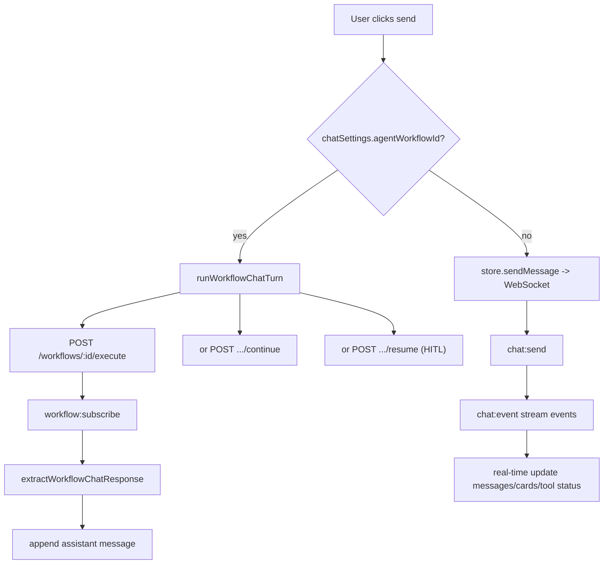

| Mode | Transport | Streaming | HITL |
|------|------|------|------|
| LangGraph (default) | WebSocket | ✅ char/event | `interrupt` + `chat:resume` |
| Published workflow | WebSocket + REST start | ✅ `workflow:event` | `waiting` + resume API |

---

## 3. LangGraph Chat Interaction Flow

### 3.1 Standard Generation Flow

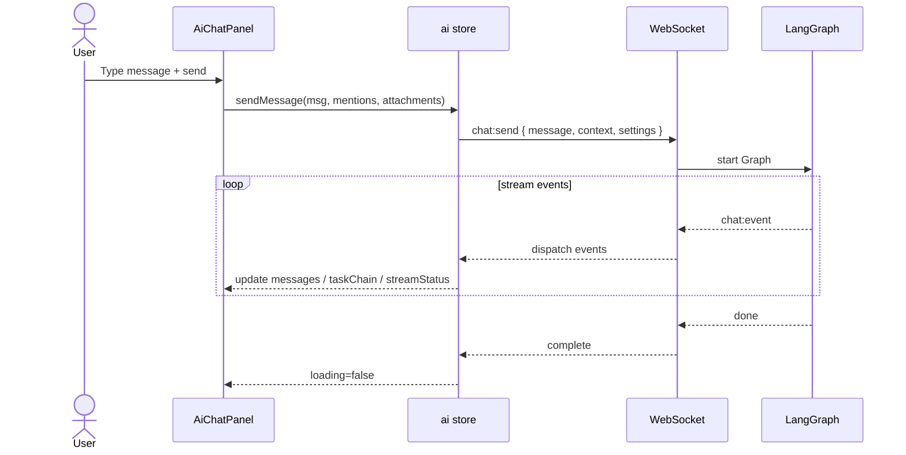

### 3.2 v2 Requirement Confirmation (HITL)

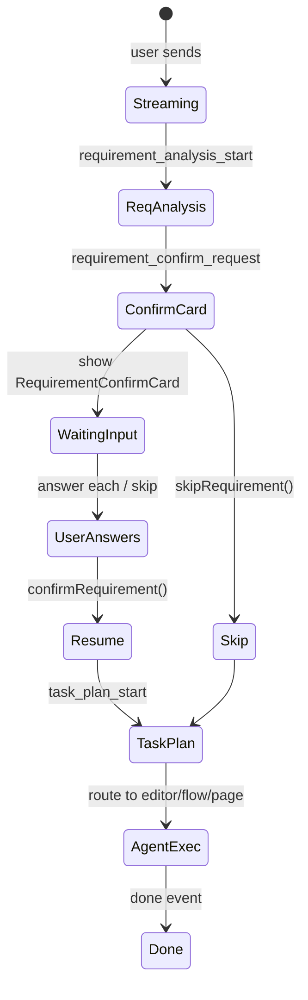

**RequirementConfirmCard interaction**:

```
┌─ Requirement confirmation ──────────────────────┐
│  Question 1/3: How many approval levels?        │
│  ○ One   ● Two   ○ Three                        │
│  [Prev]  [Next]  [Skip all]  [Confirm & continue]│
└──────────────────────────────────────────────────┘
```

After confirmation, the input placeholder changes to `requirementInputPlaceholder`.

### 3.3 Task Chain (multi-agent collaboration)

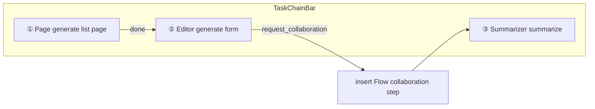

`CollaborationBar` briefly shows the collaboration source on agent switch.

### 3.4 Schema / Flow Card Actions

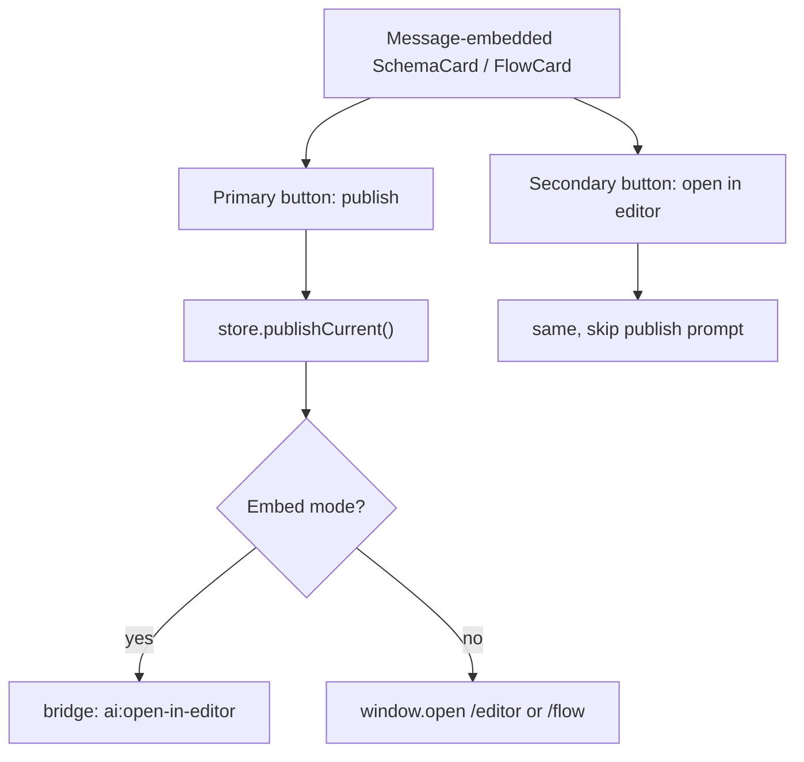

---

## 4. Workflow-mode Chat Interaction Flow

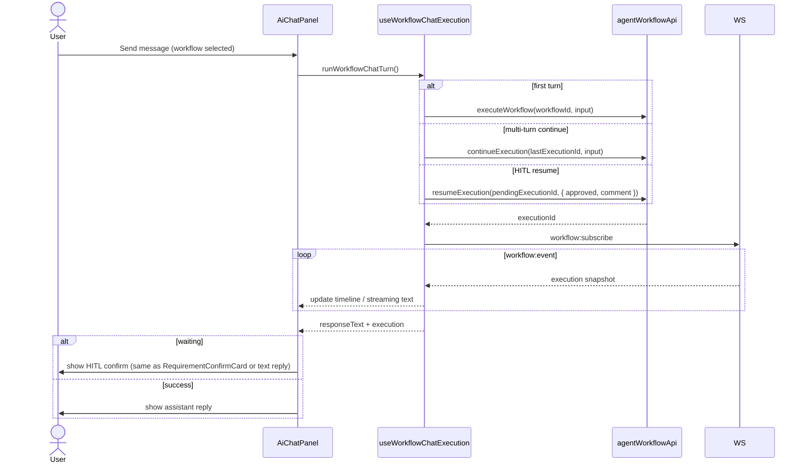

**Input payload mapping** (with document attachments):

```
input.message          <- user text
input.documentId       <- first attachment id
input.documentIds      <- all attachment ids
input.documentAttachments
input.file             <- workflow file reference
```

---

## 5. Input Area Feature Interaction

### 5.1 Document Attachments

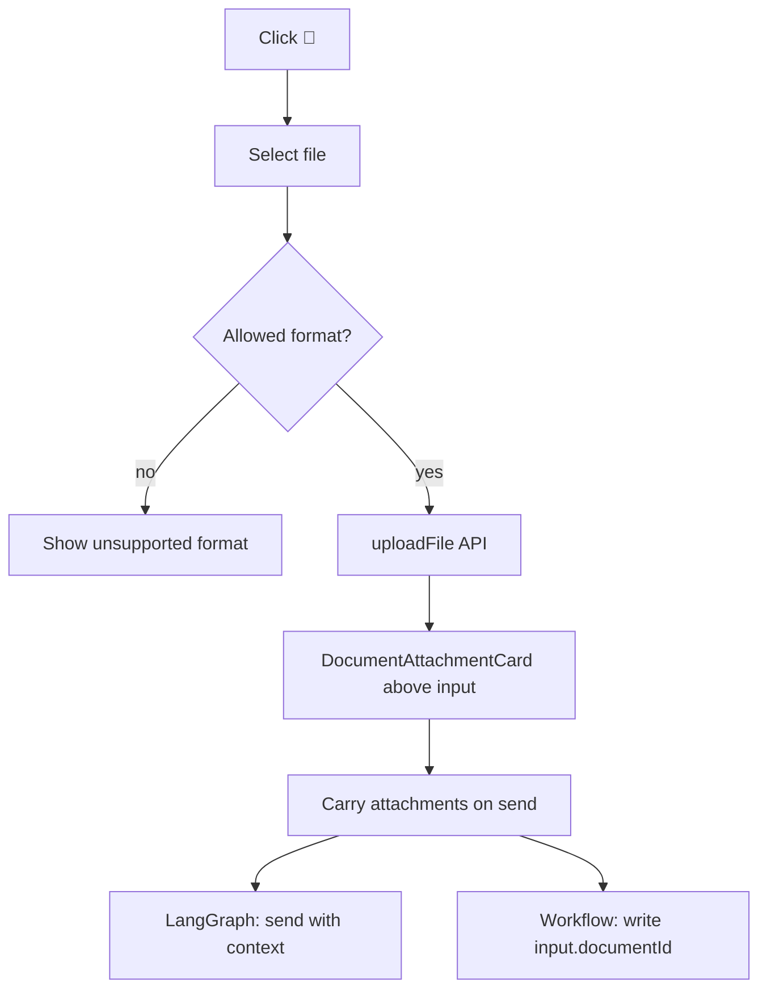

Supported formats in `@schema-platform/ai-shared/document` `DOCUMENT_UPLOAD_ACCEPT`.

### 5.2 Inline RAG Retrieval

```
Click [🔍 RAG]
    ↓
┌─ AiRagSearch overlay ─────────────────────┐
│  Search: [leave flow____________] [Search] │
│  ─────────────────────────────────────────  │
│  ○ Leave approval spec (score 0.92)        │
│  ○ Flow node notes (score 0.85)            │
└─────────────────────────────────────────────┘
    ↓ select
RAG chip appears above input -> injected as ragContext on send
```

### 5.3 @ Mention Reference

`AiMentionInput` typing `@` triggers Schema/Flow search; the selection is sent as `mentions` with the message for the Agent to precisely locate context.

### 5.4 Settings Drawer

```
┌─ Chat settings (320px Drawer) ─────────┐
│ ▼ Connection status                     │
│   ● API key configured                  │
│   DeepSeek deepseek-chat [default]      │
│ ▼ Model                                 │
│   Chat model: [DeepSeek Chat ▼]         │
│ ▼ Workflow                              │
│   [Select published workflow ▼]         │
│   Leave empty to use LangGraph engine   │
│ [Cancel]  [Save]                        │
└─────────────────────────────────────────┘
```

---

## 6. Message Component States

### 6.1 Assistant Message Structure

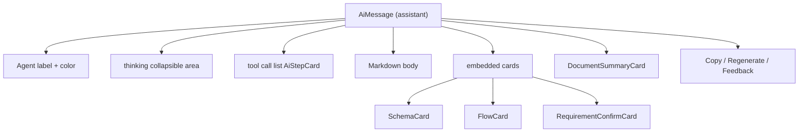

### 6.2 Streaming Connection State

| streamStatus | UI |
|--------------|---------|
| `idle` | normal |
| `connecting` | send disabled, showing connecting |
| `streaming` | show stop button, message updates char by char |
| `reconnecting` | show retry count `retryCount / MAX_AUTO_RETRIES` |
| `error` | show retry button |

Top-bar WS indicator: `isConnected()` polled every second; green dot = connected.

---

## 7. Conversation History

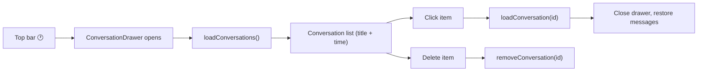

---

## 8. Empty States & Errors

| Scenario | UI |
|------|------|
| New chat | empty message area + welcome hint |
| WS disconnected | top-bar red dot "disconnected", send may fail |
| Conversation 404 | Toast "conversation not found or deleted", refresh list |
| Workflow execution failed | assistant message shows error text |
| Tool call failed | AiStepCard red state + retry button |

---

## 9. Runtime Architecture

> Full runtime diagram in [runtime.md](./runtime.md)

### LangGraph Request Path

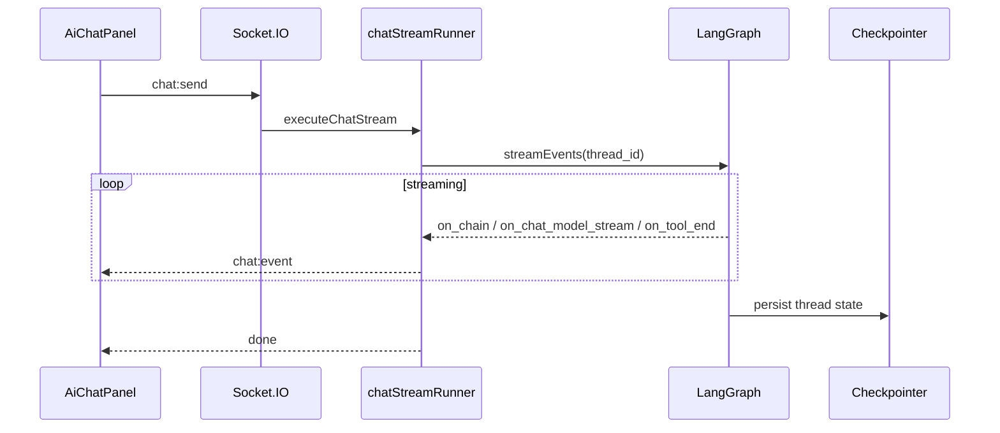

### Dual-backend Runtime Branch

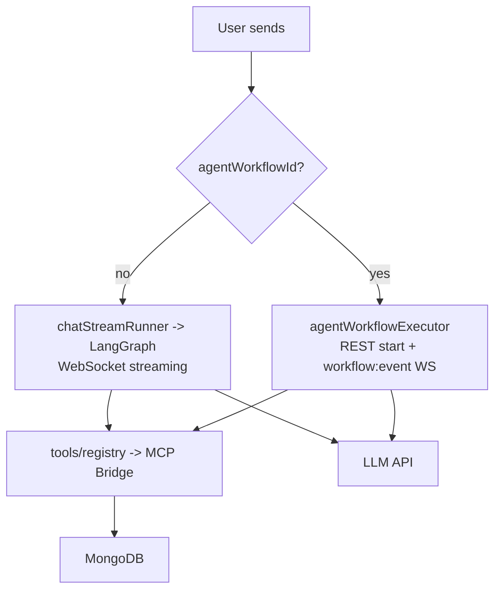
