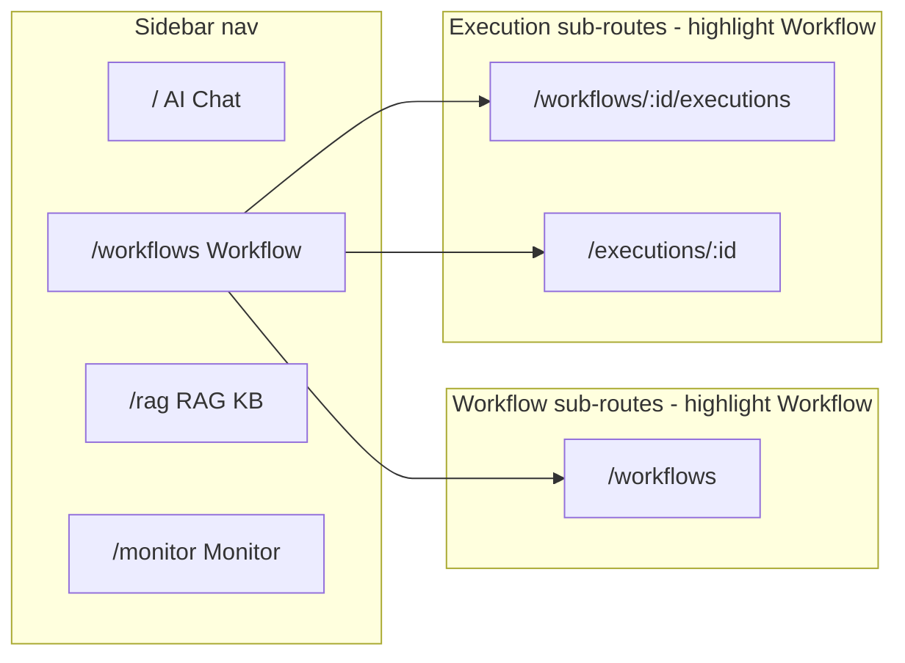
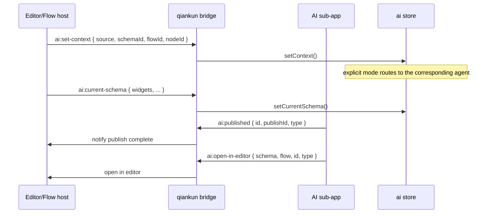
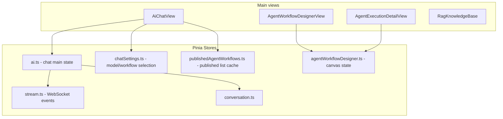
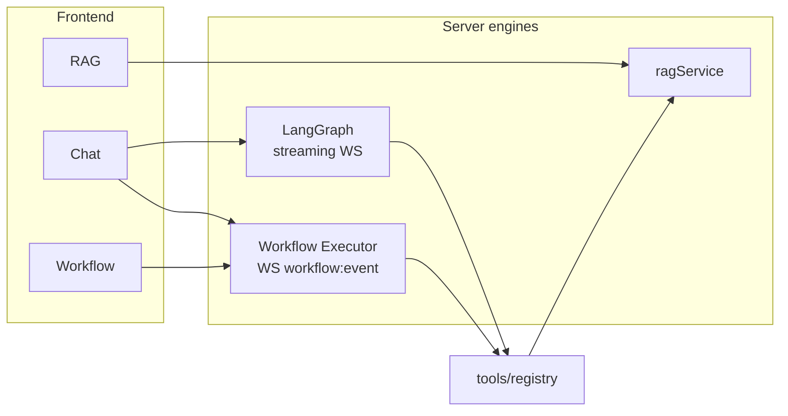

# Information Architecture & Layout

## 1. App Shell

### 1.1 Standalone Mode Wireframe

```
┌──────────────────────────────────────────────────────────────────────────┐
│ AiLayout                                                                 │
├────────────┬─────────────────────────────────────────────────────────────┤
│  Sidebar   │  Main content (router-view)                                 │
│  200px     │                                                             │
│            │                                                             │
│  [AI Logo] │                                                             │
│  Assistant │                                                             │
│ ────────── │                                                             │
│ ● AI Chat  │                                                             │
│   Workflow │                                                             │
│   RAG KB   │                                                             │
│   Monitor  │                                                             │
│ ────────── │                                                             │
│   Sidebar  │                                                             │
└────────────┴─────────────────────────────────────────────────────────────┘
```

### 1.2 qiankun Embed Mode

When the Shell already provides the main navigation, the sub-app hides its left sidebar and the main content fills the width:

```
┌──────────────────────────────────────────────────────────────────────────┐
│ Shell top bar / menu                                                     │
├──────────────────────────────────────────────────────────────────────────┤
│                                                                          │
│                    AI sub-app main content (100% width)                  │
│                                                                          │
└──────────────────────────────────────────────────────────────────────────┘
```

Embed detection: `useShellEmbed().shouldHideSubAppMenu`

### 1.3 Full-screen Pages (outside the AiLayout sidebar)

The designer and execution detail are standalone full-screen routes with their own top toolbar:

| Route | Layout |
|------|------|
| `/workflows/:id` | top Toolbar + three-pane designer |
| `/executions/:id` | top status bar + canvas + bottom/side panel |

---

## 2. Routes & Navigation Highlight



`activeNav` rule: both `/workflows*` and `/executions*` activate "Workflow".

---

## 3. Embedding Integration (editor / flow)

### 3.1 Bridge Events



### 3.2 Sidebar Mode (`/sidebar`)

A 400px-wide compact Chat embedded in the editor/flow right panel:

```
┌──────────────────────────────┐ 400px
│ Context bar [Schema ▼] [Node]│
│ WS ● connected  [History] [WF▼]│
├──────────────────────────────┤
│                              │
│   Message list (no preview)  │
│                              │
├──────────────────────────────┤
│  Agent: Auto ▼               │
│  ┌────────────────────────┐  │
│  │ Type a message...      │  │
│  └────────────────────────┘  │
│  [Attach] [RAG] [Send]       │
└──────────────────────────────┘
```

Differences from full-screen Chat:

| Capability | Full-screen Chat | Sidebar |
|------|-----------|--------|
| Conversation history | right Drawer | Popover |
| Preview panel | none (single column) | none |
| Context bar | none | yes (Schema/Flow/Node) |
| Publish jump | open editor/flow in new window | bridge notifies host |

---

## 4. Colors & Agent Identity

| Agent | Use case | Message label color |
|-------|------|-----------|
| `auto` / router | auto-routing | default blue |
| `editor` | form | green |
| `flow` | flow | orange |
| `page` | page | purple |
| `general` | general | gray |

Workflow node colors in `constants/agentNodes.ts` `AGENT_NODE_COLORS`.

---

## 5. Global State Store Relationships



---

## 6. Runtime Overview



See [runtime.md](./runtime.md).
