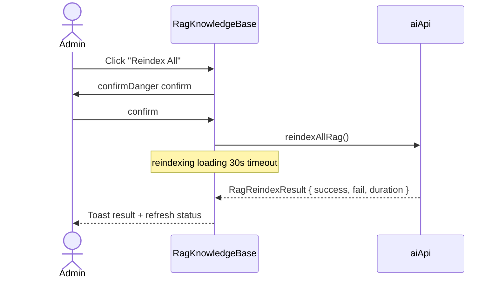
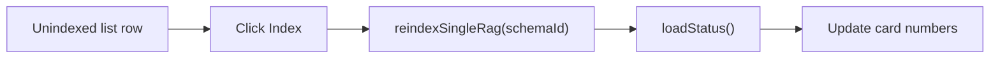
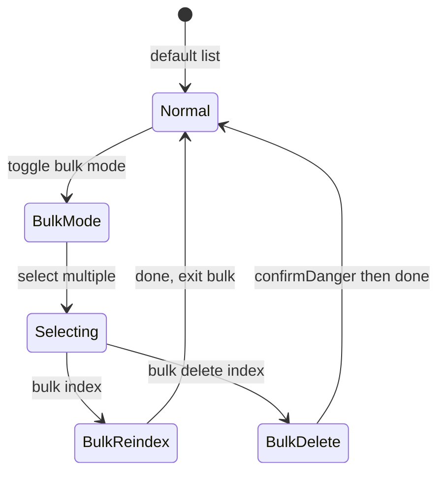
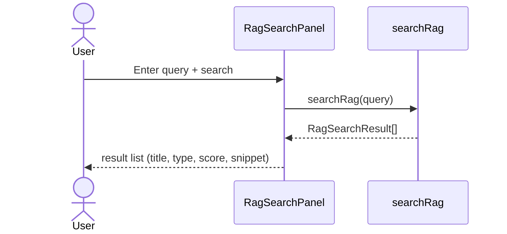
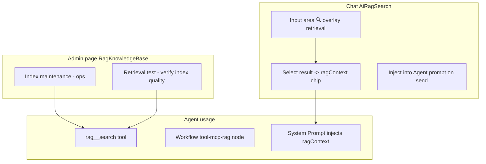
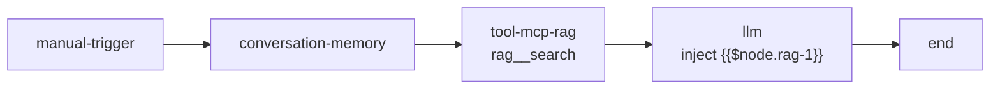
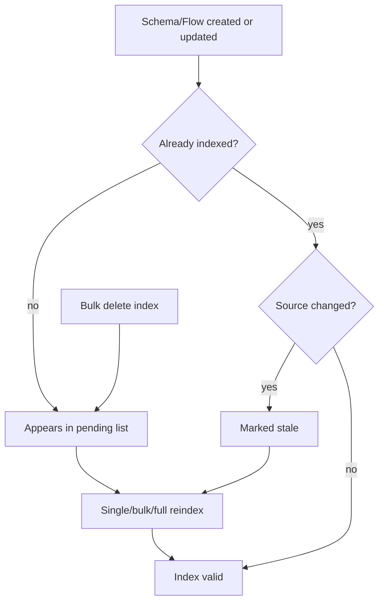
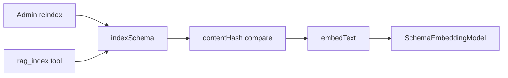
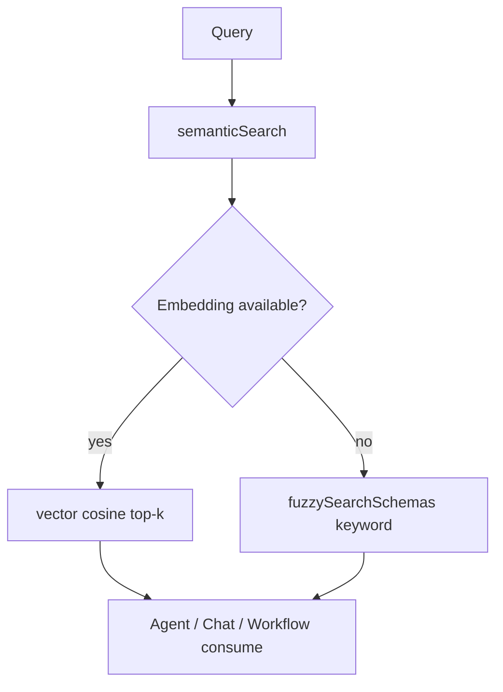

# RAG Knowledge Base - Design Draft & Interaction Flow

## 1. Page Wireframe (RagKnowledgeBase)

Layout aligned with the monitor: Dashboard top bar + summary cards + dual-column panels + full-width table.

```
┌──────────────────────────────────────────────────────────────────────────┐
│ RAG Knowledge Base            [Reindex All]  [Refresh Status]            │
├──────────────────────────────────────────────────────────────────────────┤
│ ┌──────┐ ┌──────┐ ┌──────┐ ┌──────┐ ┌──────┐ ┌──────┐                   │
│ │Flows │ │Schema│ │Index │ │Pending│ │Stale │ │Cover │  <- RagSummary    │
│ │  42  │ │  128 │ │  150 │ │   20 │ │   3  │ │  88% │                   │
│ └──────┘ └──────┘ └──────┘ └──────┘ └──────┘ └──────┘                   │
├──────────────────────────────┬───────────────────────────────────────────┤
│  RagSearchPanel              │  RagIndexOverview                         │
│  ┌────────────────────────┐  │  Unindexed schema list                    │
│  │ 🔍 Retrieval test      │  │  [Bulk mode] [Bulk index] [Bulk delete]   │
│  │ [leave flow________] [Search]│  ┌────────────────────────────────────┐  │
│  └────────────────────────┘  │  │ ☐ User Register    schema-001 [Index]│  │
│  Results:                    │  │ ☐ Leave Request    schema-002 [Index]│  │
│  ┌────────────────────────┐  │  │ ...                                │  │
│  │ Leave approval spec  0.92│  │  └────────────────────────────────────┘  │
│  │ schema / form design ... │  │  Pagination: < 1 2 3 >                  │
│  └────────────────────────┘  │                                           │
├──────────────────────────────┴───────────────────────────────────────────┤
│  Last reindex result (if any): success 150 / fail 2 / duration 45s       │
└──────────────────────────────────────────────────────────────────────────┘
```

---

## 2. Metric Definitions

| Metric | Source field | Meaning |
|------|----------|------|
| Total flows | `totalFlows` | number of platform flows |
| Total schemas | `totalSchemas` | number of platform forms |
| Indexed | `indexed` + `indexedFlows` | resources with a vector index |
| Pending | `unindexed` | schemas not yet indexed |
| Stale | `stale` | indexes needing rebuild after source change |
| Coverage | computed | `(indexed) / (total) * 100%` |

Coverage color: >=90% green, >=50% yellow, <50% red.

---

## 3. Index Management Flow

### 3.1 Full Reindex



### 3.2 Single Index



### 3.3 Bulk Operations



Bulk delete calls `deleteRagEmbedding(id)`, removing only the vector index, not the source schema.

---

## 4. Retrieval Test Flow

The left `RagSearchPanel` on the admin page verifies index quality:



Result item structure (`RagSearchResult`):

| Field | Display |
|------|------|
| `title` | main title |
| `type` | schema / flow / document |
| `score` | relevance 0-1 |
| `snippet` | matched fragment preview |
| `id` | resource ID |

---

## 5. Chat Inline RAG Flow

RAG in Chat shares the same retrieval API as the admin page, but the interaction differs:



### Chat Inline RAG Wireframe

```
Above input area (before send):
┌─ Selected knowledge ──────────────────────────┐
│  📄 Leave approval spec (0.92) ×  📄 Form design guide ×│
└────────────────────────────────────────────────┘

Click [🔍 RAG] pops up:
┌─ Knowledge retrieval ─────────────────────────┐
│  [search keyword________________] [Search]    │
│  ─────────────────────────────────────────────│
│  + Leave approval spec      schema   0.92     │
│  + Flow node config notes   flow     0.85     │
│  (click + to add to selected)                 │
└────────────────────────────────────────────────┘
```

Store methods:

| Action | Method |
|------|------|
| Search | `searchRagAction(query)` |
| Add | `addRagContext(item)` |
| Remove | `removeRagContext(id)` |

---

## 6. RAG in Workflow

The "Smart Assistant Q&A" template includes a RAG node:



LLM prompt template:

```
Knowledge base retrieval result: {{$node.rag-1}}
Current question: {{$input.message}}
Conversation history: {{$conversation}}
```

---

## 7. Index Lifecycle



---

## 8. Errors & Empty States

| Scenario | UI |
|------|---------|
| Status loading | summary cards show skeleton/loading |
| Load timeout 15s | `useDataLoading` timeout hint |
| Full reindex failed | Toast error + `lastReindexResult` shows fail count |
| No search results | RagSearchPanel "No relevant content found" |
| Pending empty | list empty state + coverage 100% green |
| Bulk partial failure | `Indexed N succeeded, M failed` warning |

---

## 9. Relationship with MCP

```
RagKnowledgeBase (admin UI)
        │
        ▼
   aiApi.reindex* / searchRag
        │
        ▼
   server RAG service
        │
        ▼
   MCP ragServer -> rag__search
        │
        ▼
   LangGraph / Workflow tool call
```

The admin page handles **index ops**; the Agent runtime **consumes** the index via the `rag__search` tool or Chat `ragContext`.

---

## 10. Runtime Architecture

> Full runtime diagram in [runtime.md](./runtime.md)

### Index Runtime



### Retrieval Runtime


