# Runtime Architecture

> Server execution paths, data flow, state persistence - read alongside the UI interaction flows ([chat](./chat.md) / [workflows](./workflows.md) / [rag](./rag.md))

---

## 1. Platform Runtime Overview

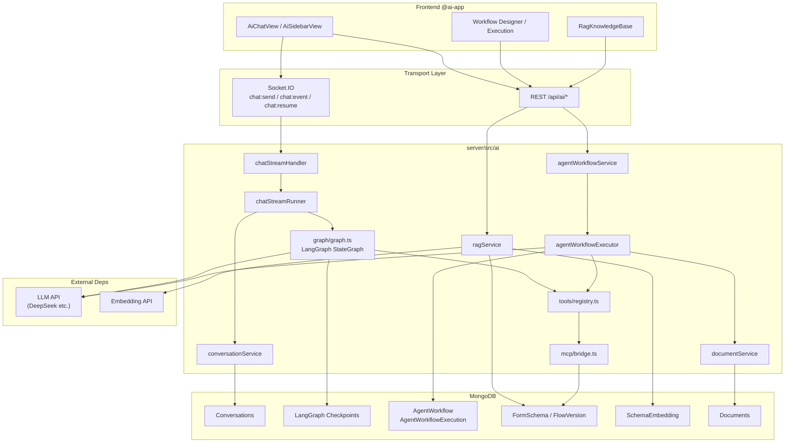

### Dual-engine Runtime Comparison

| Dimension | Chat LangGraph | Agent Workflow |
|------|----------------|----------------|
| Entry | `chat:send` (WebSocket) | `POST .../execute` / Webhook |
| Orchestration | `graph.streamEvents()` | `executeAgentWorkflow()` while loop |
| State | Checkpointer + threadId | `AgentWorkflowExecution.nodeRecords` |
| Output | streaming `chat:event` | `workflow:event` pushes nodeRecords / streamingOutput |
| Cancel | `graphAbort.abort()` | execution `cancelled` |
| HITL | `interrupt` + `chat:resume` | `hitl` node + `POST .../resume` |

---

## 2. Chat LangGraph Runtime

### 2.1 Request Processing Path

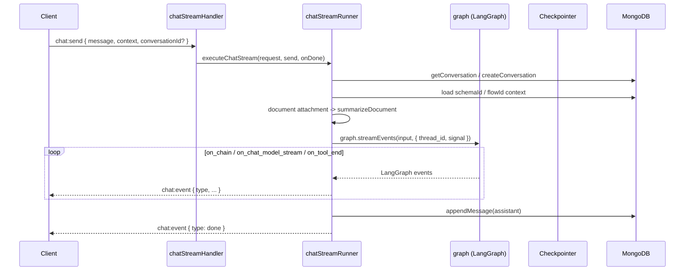

**Core**: `chatStreamRunner.executeChatStream` is called by the WebSocket `chatStreamHandler` and pushes `chat:event` via the `send` callback.

### 2.2 LangGraph Compiled Graph (runtime nodes)

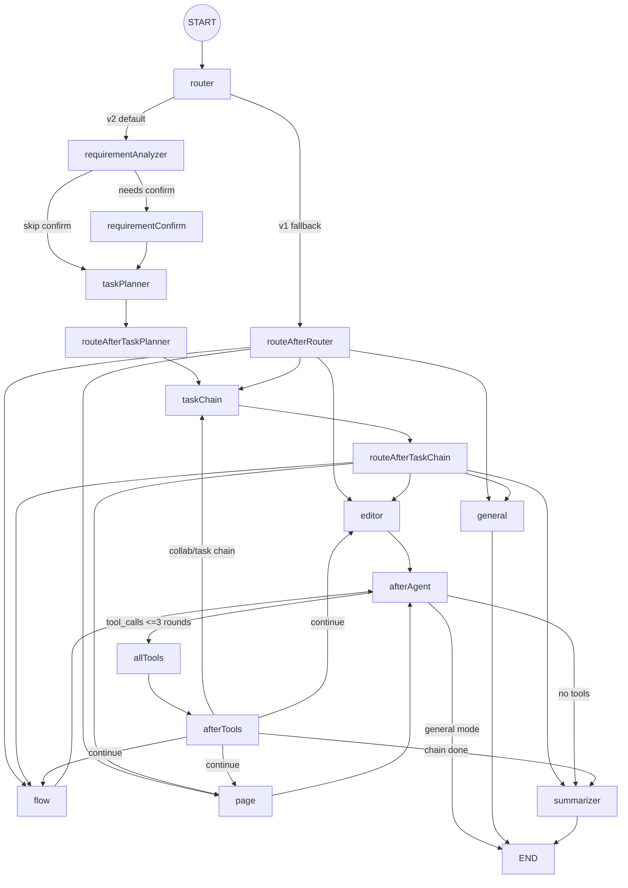

**Env switch** (`graph.ts` `V2_CONFIG`):

- `AI_ENABLE_TASK_PLANNER !== 'false'` -> enable taskPlanner

### 2.3 streamEvents -> Frontend Event Mapping

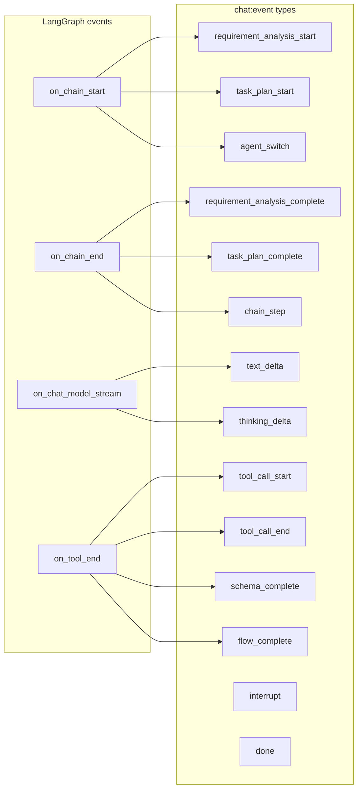

### 2.4 Tool Call Runtime

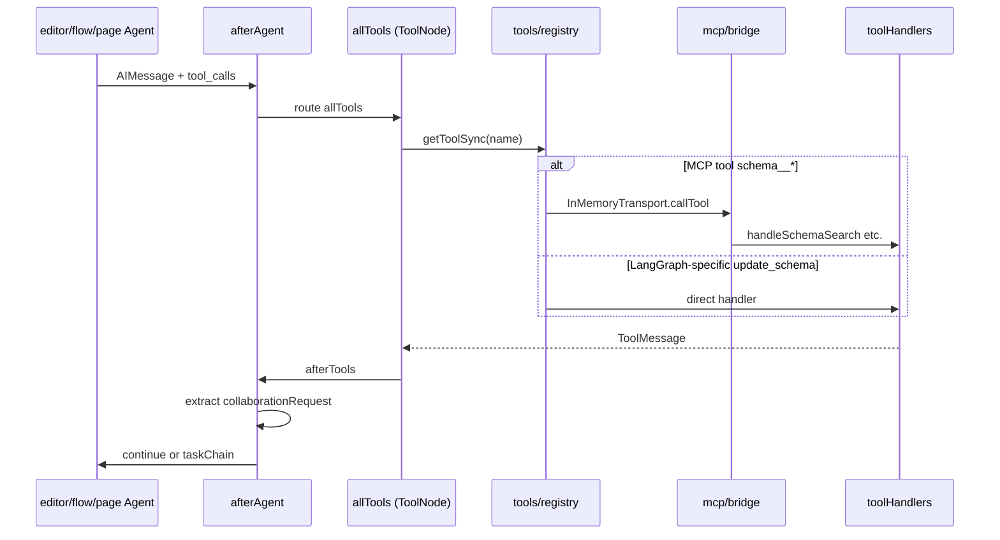

**Limits**:
- `afterAgent`: at most 3 tool iterations per round (`MAX_TOOL_ITERATIONS`)
- `router`: `session.maxNodeExecutions` global node cap

### 2.5 Checkpoint & HITL Resume

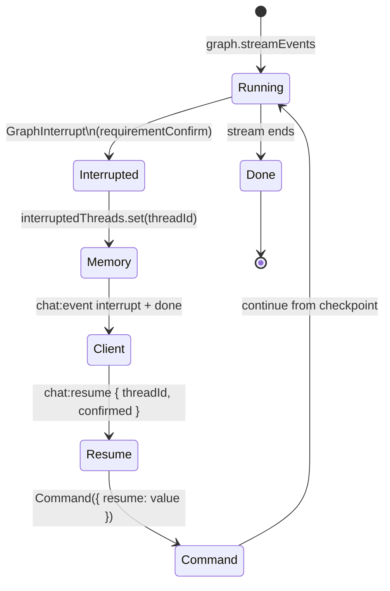

| Storage | Content |
|------|------|
| MongoDB Checkpointer | LangGraph thread state (required in production) |
| `interruptedThreads` Map | in-memory HITL interrupt metadata |
| Conversations | message history, schema/flow versions |

---

## 3. Agent Workflow Runtime

### 3.1 Trigger & Async Execution

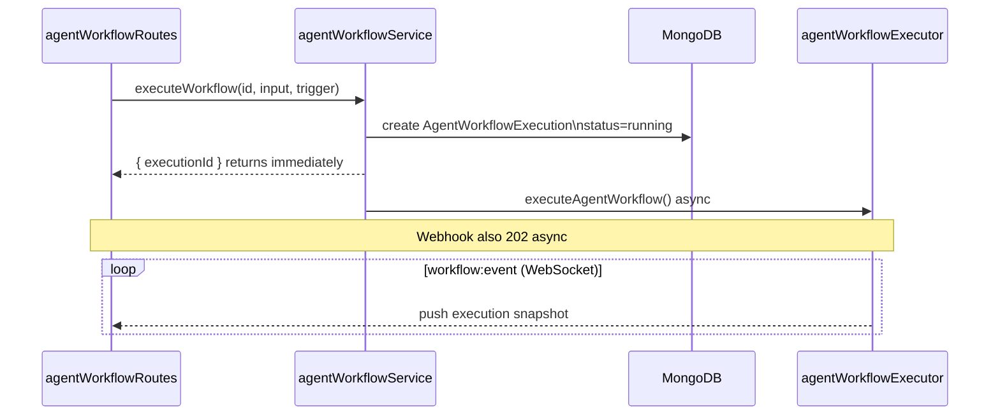

### 3.2 Executor Main Loop

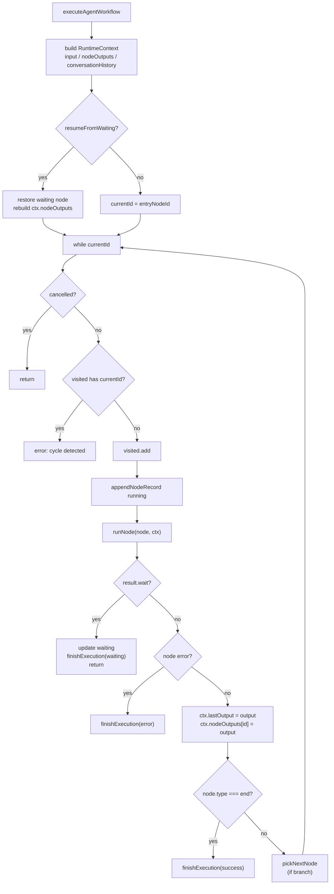

### 3.3 RuntimeContext Data Flow

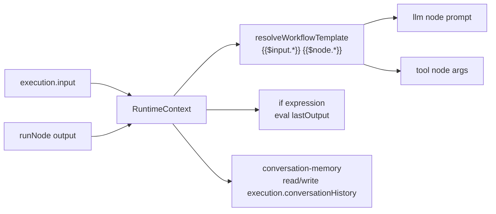

### 3.4 Node Dispatch (runNode)

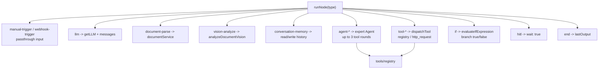

### 3.5 Chat-triggered Workflow Runtime

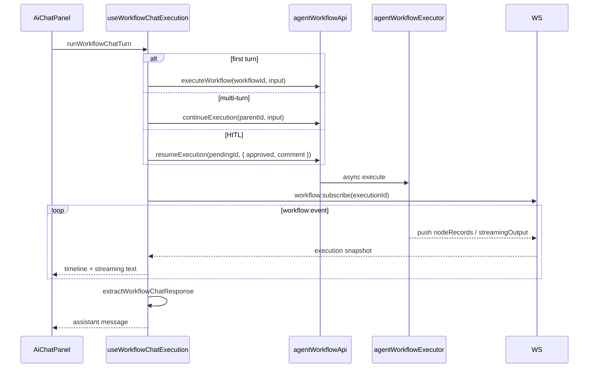

---

## 4. RAG Runtime

### 4.1 Index Pipeline

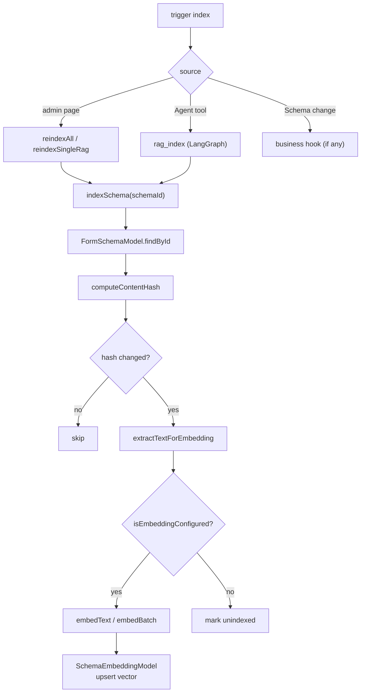

### 4.2 Retrieval Pipeline

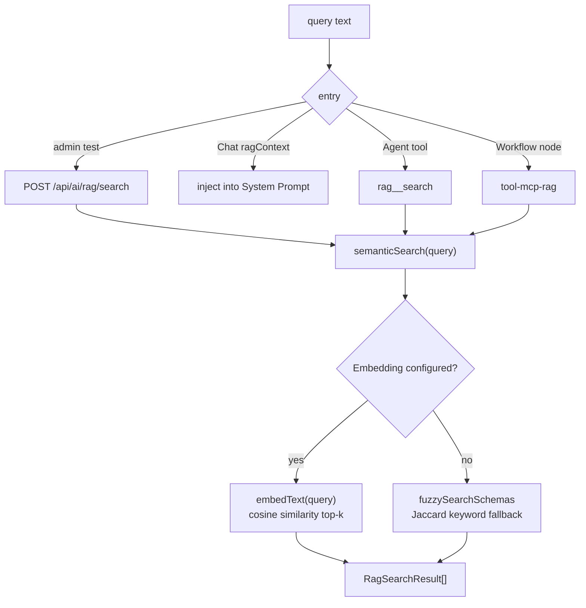

### 4.3 RAG Position in the Chat Agent Runtime

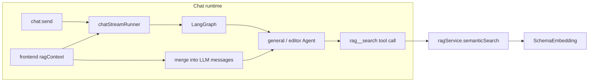

---

## 5. Tool Registry Startup Sequence

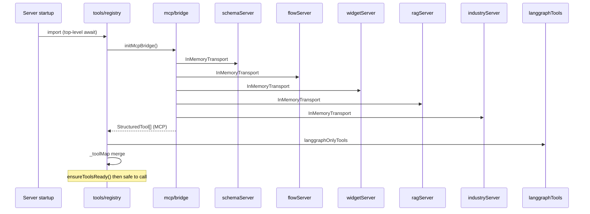

**Degradation**: if MCP bridging fails completely, falls back to `langgraphOnlyTools` only; Chat still runs (no MCP read capability).

---

## 6. Document Pipeline Runtime

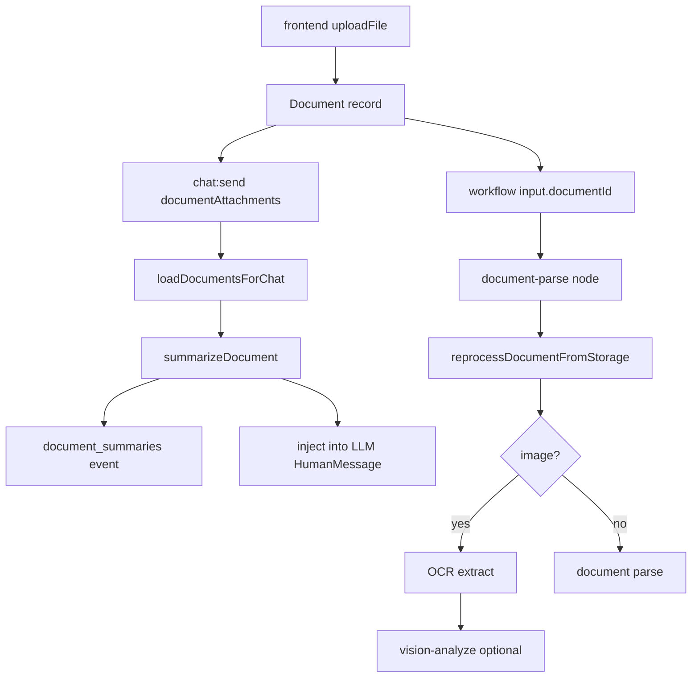

---

## 7. Monitoring Runtime (AiMonitorView)

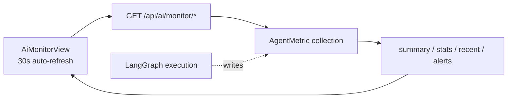

Monitoring collection points write `AgentMetric` during LangGraph / Agent execution, **stored separately** from workflow execution records (`AgentWorkflowExecution`).

---

## 8. Key Runtime Constraint Quick Reference

| Constraint | Value | Location |
|------|-----|------|
| Agent per-round tool cap | 3 | `graph.ts` afterAgent |
| Workflow expert node tool cap | 3 | agentWorkflowExecutor |
| LangGraph recursionLimit | 30 | chatStreamRunner |
| Chat Workflow progress | WebSocket `workflow:event` | useWorkflowExecutionStream |
| Version snapshot cap | 20 | agentWorkflowService |
| MCP tool failure | returns recoverable JSON | mcp/bridge |
| RAG without Embedding | keyword Jaccard fallback | ragService |
| Checkpointer production | must be MongoDB | checkpointer.ts |

---

## 9. Related Docs

| Doc | Focus |
|------|------|
| [chat.md](./chat.md) | Chat UI interaction flow |
| [workflows.md](./workflows.md) | Workflow UI interaction flow |
| [rag.md](./rag.md) | RAG UI interaction flow |
| [../architecture.md](../architecture.md) | architecture description |
| [../agent-workflow.md](../agent-workflow.md) | workflow API & nodes |
| [../events.md](../events.md) | event protocol |
