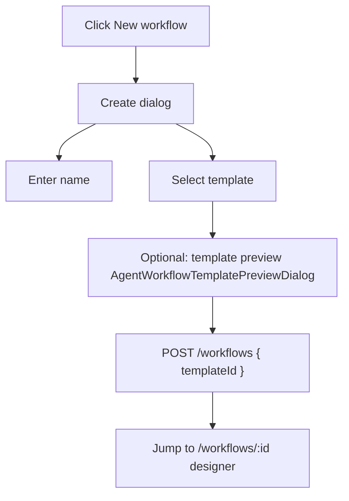
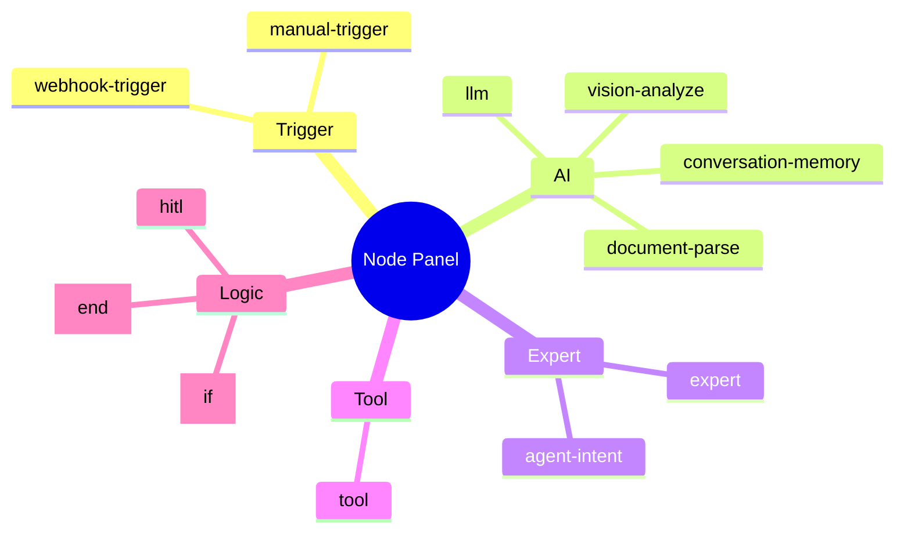
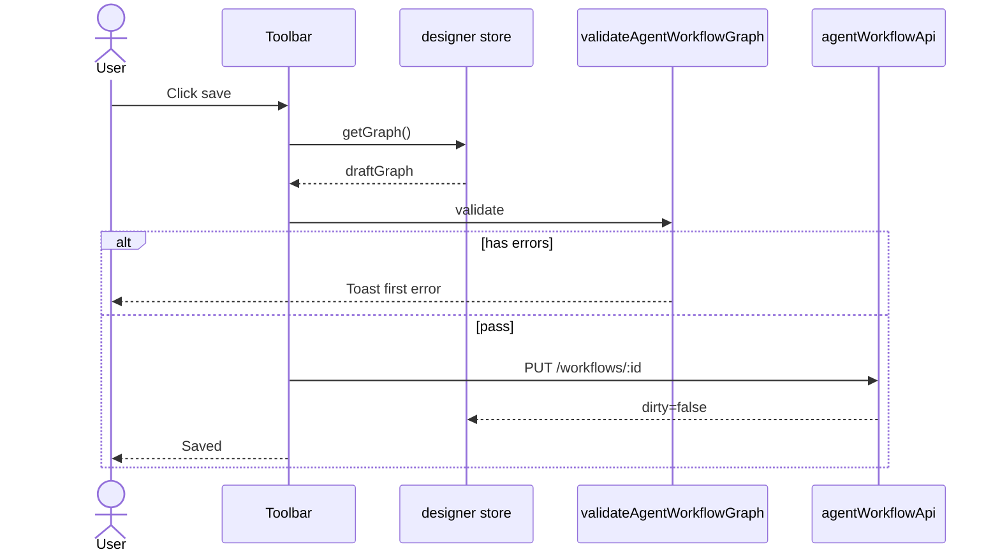
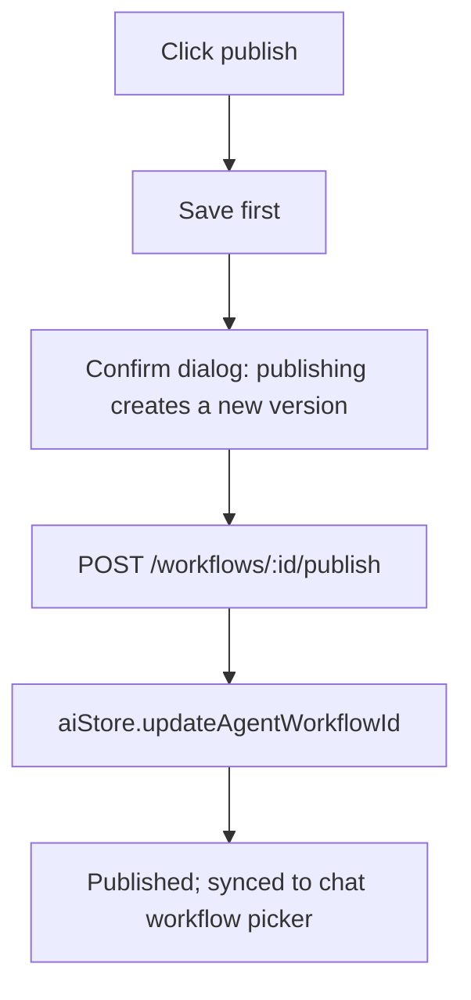
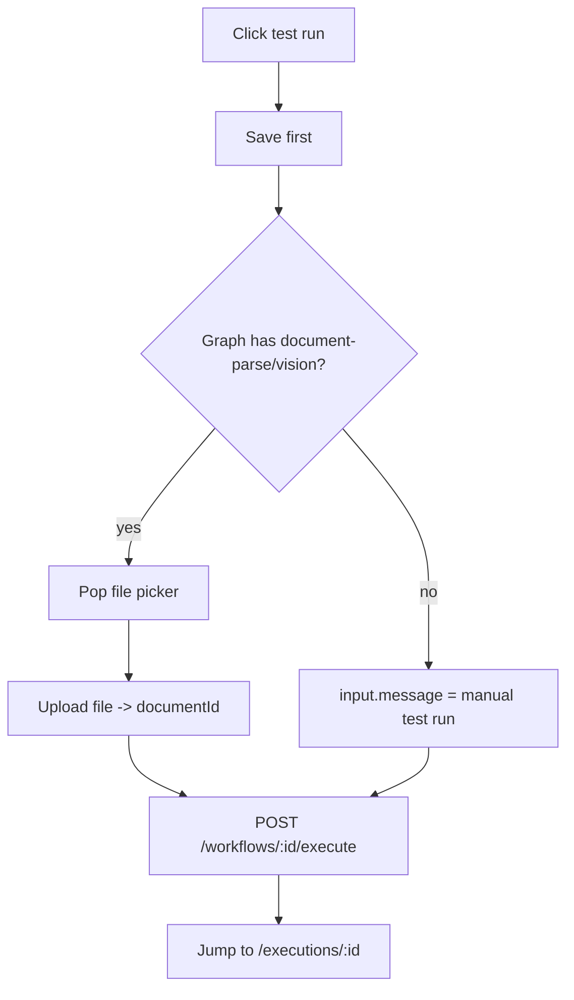
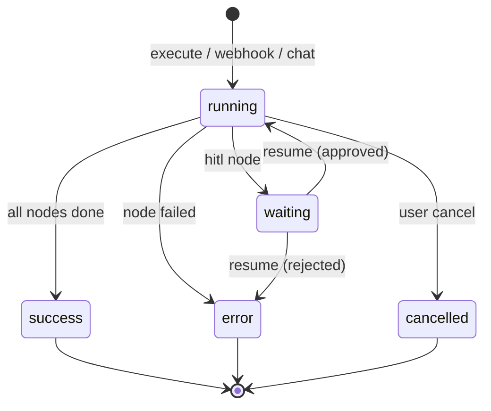
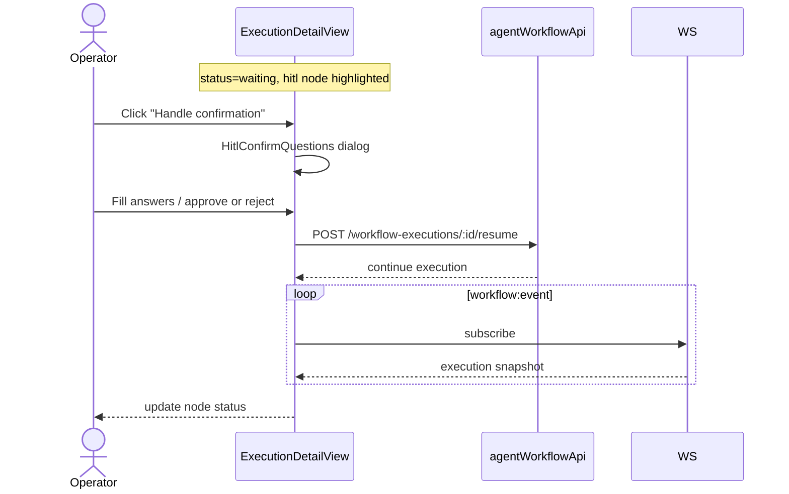
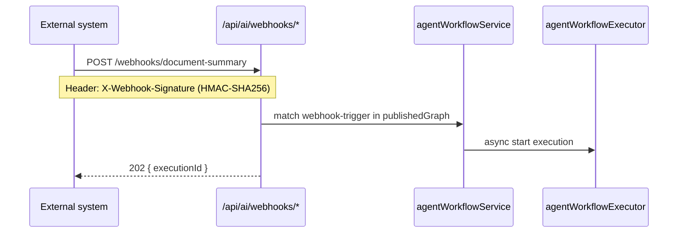
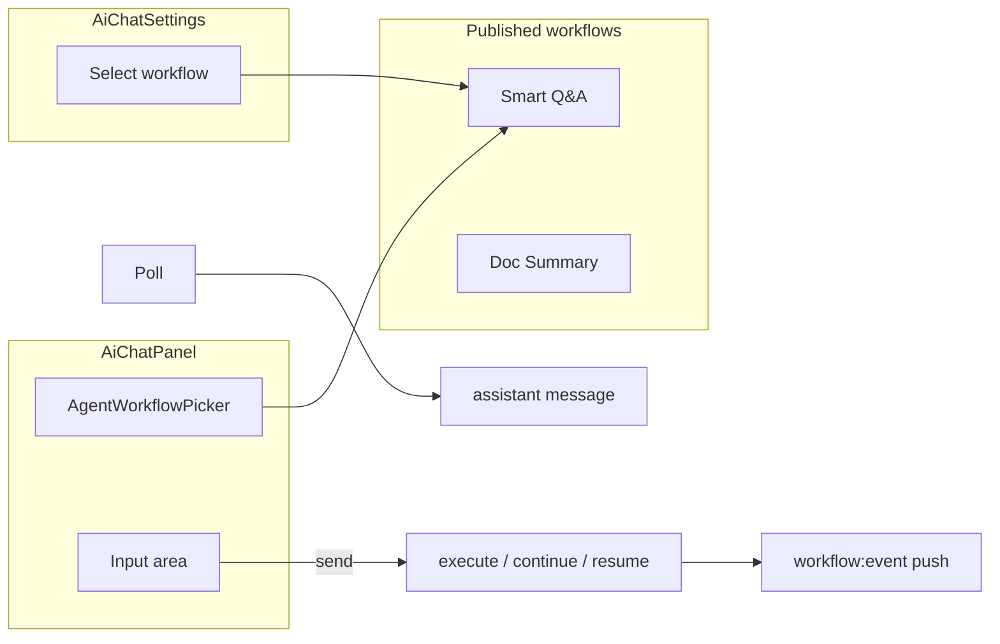
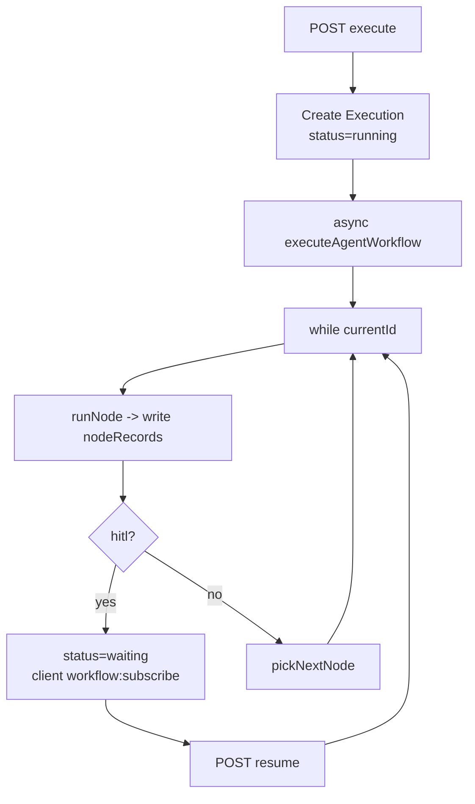

# Agent Orchestration - Design Draft & Interaction Flow

## 1. List Page Wireframe (AgentWorkflowListView)

```
┌──────────────────────────────────────────────────────────────────────────┐
│ Agent orchestration                       [+ New workflow]                │
├──────────────────────────────────────────────────────────────────────────┤
│ [All] [Draft] [Published] [Templates]  🔍 Search...  Sort: [Recent ▼]   │
├──────────────────────────────────────────────────────────────────────────┤
│                                                                          │
│  ┌─────────────────┐  ┌─────────────────┐  ┌─────────────────┐          │
│  │ 📋 Doc Summary  │  │ 🤖 Smart Q&A    │  │ 📝 My Workflow  │          │
│  │ Published v2026.│  │ Draft           │  │ Draft           │          │
│  │ Updated 2h ago  │  │ Updated yesterday│  │ Updated 3d ago  │          │
│  │ [Design][Publish]│  │ [Design][Publish]│  │ [Design][Delete]│          │
│  └─────────────────┘  └─────────────────┘  └─────────────────┘          │
│                                                                          │
└──────────────────────────────────────────────────────────────────────────┘
```

### Tab Behavior

| Tab | Content |
|-----|------|
| All | all workflow cards |
| Draft | `status === draft` |
| Published | `status === published` |
| Templates | system template cards (`AGENT_WORKFLOW_TEMPLATES`, excludes blank) |

### New Flow



---

## 2. Designer Wireframe (AgentWorkflowDesignerView)

Full-screen three-pane layout, no AiLayout sidebar:

```
┌──────────────────────────────────────────────────────────────────────────┐
│ Toolbar: ← Back │ Name [editable] │ [Save][Publish][Test run][Version][Validate]│
├──────────┬───────────────────────────────────────────────┬───────────────┤
│ Palette  │              Canvas (Vue Flow)               │ PropertyPanel │
│ 200px    │                                              │ 320px         │
│          │   ┌─────────┐      ┌─────────┐                │               │
│ ▼ Trigger│   │Manual    │─────▶│  LLM    │────▶ [End]    │ Node: LLM     │
│  Manual  │   │trigger   │      │         │                │  Prompt: ...  │
│  Webhook │   └─────────┘      └─────────┘                │  Model: default│
│ ▼ AI     │                                              │  {{$input...}} │
│  LLM     │      Drag to connect / select highlight      │               │
│  Doc parse│  Exec highlight: green=done blue=running red=failed│ [Variable ref]│
│ ▼ Expert │                                              │               │
│ ▼ Tool   │                                              │               │
│ ▼ Logic  │                                              │               │
│  [◀][▶] collapse panel                                 │  [◀][▶] collapse│
└──────────┴───────────────────────────────────────────────┴───────────────┘
```

### Panel Collapse

- `showLeft` / `showRight` toggle the left/right panels
- The canvas area adapts and expands

### Node Panel Categories (Palette)



Drag onto the canvas -> auto-select -> the right shows the corresponding PropertyPanel.

---

## 3. Designer Core Interaction Flow

### 3.1 Edit -> Save



### 3.2 Publish



### 3.3 Test Run



Canvas node real-time highlight: `store.applyExecutionHighlight(active, completed, records)`

---

## 4. Property Panel Interaction

`useAgentNodePropertyPanel` maps panel components by node type:

| Node type | Panel component |
|----------|----------|
| `manual-trigger` | TriggerNodePanel |
| `webhook-trigger` | WebhookTriggerNodePanel |
| `llm` | LlmNodePanel + VariableReferencePanel |
| `document-parse` | DocumentParseNodePanel |
| `vision-analyze` | VisionAnalyzeNodePanel |
| `conversation-memory` | ConversationMemoryNodePanel |
| `agent*` | AgentNodePanel |
| `tool*` | ToolNodePanel |
| `if` | IfNodePanel |
| `hitl` | HitlNodePanel |
| other | DefaultNodePanel |

### Variable Reference Panel

```
┌─ Available variables ───────────────┐
│ {{$input.message}}                  │
│ {{$node.parse-1.text}}              │
│ {{$conversation}}                   │
│ {{$json}}                           │
│         [Click to insert into prompt]│
└──────────────────────────────────────┘
```

### HITL Node Config

```
Confirm message: [Please confirm the following info]
▼ Confirm questions
  Q1: [Approval levels?]
  Options: One, Two, Three
  [+ Add question]
☑ Inherit upstream confirm questions
```

---

## 5. Execution Monitoring

### 5.1 Execution List (AgentExecutionListView)

```
┌──────────────────────────────────────────────────────────────────────────┐
│ ← Back to workflow │ Doc Summary - execution records                     │
├──────────────────────────────────────────────────────────────────────────┤
│  ID          Trigger   Status    Start time     Duration                │
│  exec-001    manual   ● success 14:30:00      12.3s                     │
│  exec-002    webhook  ● failed  14:25:00      3.1s                      │
│  exec-003    chat     ◐ waiting 14:20:00      -                         │
└──────────────────────────────────────────────────────────────────────────┘
```

### 5.2 Execution Detail Wireframe (AgentExecutionDetailView)

```
┌──────────────────────────────────────────────────────────────────────────┐
│ ← Back │ Execution exec-003  ◐ waiting │ Trigger: chat │ [Cancel]        │
├──────────────────────────────────────────────────────────────────────────┤
│                                                                          │
│              Canvas (read-only, node status coloring)                    │
│         [Manual trigger]──▶[RAG]──▶[LLM]──▶[HITL ●]──▶[End]             │
│                                                                          │
├──────────────────────────────────────────────────────────────────────────┤
│ ▼ Bottom panel [Node records] [Logs] [Node detail]              [Expand] │
│ ┌────────────────────────────────────────────────────────────────────┐   │
│ │ ● hitl-1  waiting  14:20:05                                         │   │
│ │ ✓ rag-1   success  14:20:03  -> click to expand AgentNodeExecutionDetail│   │
│ │ ✓ trigger success  14:20:01                                         │   │
│ └────────────────────────────────────────────────────────────────────┘   │
└──────────────────────────────────────────────────────────────────────────┘
```

### 5.3 Execution State Machine



### 5.4 HITL Resume Interaction



In-designer test runs that hit HITL also jump to the execution detail page.

---

## 6. Webhook Trigger Flow



Webhook config is in the designer `webhook-trigger` node: `webhookPath` + `webhookMethod`; after publish you get `webhookSecret`.

---

## 7. Integration with Chat



After publishing a workflow, `updateAgentWorkflowId` auto-syncs so users can pick it in Chat.

---

## 8. Node Visual States (canvas)

| State | Node border/icon | Scenario |
|------|--------------|------|
| Default | gray | design mode |
| Selected | blue highlight | editing properties |
| running | blue pulse | executing |
| success | green | done |
| error | red | failed |
| waiting | orange | HITL paused |

Edges (`AgentFlowEdge`): `if` branches labeled `true` / `false`; during execution the active path is highlighted.

---

## 9. Version Management

Toolbar "Version" dropdown:

```
┌─ Version history ───────────────┐
│ ● v20260706143000  (current draft)│
│   v20260705120000               │
│   v20260704100000  [published]   │
│   ...                           │
│ [View snapshot]                 │
└─────────────────────────────────┘
```

Selecting a historical version shows the graph snapshot (read-only) and does not overwrite the current draft.

---

## 10. Runtime Architecture

> Full runtime diagram in [runtime.md](./runtime.md)

### Executor Main Loop



### Runtime Relationship with Chat

| Trigger | API | Execution engine |
|------|-----|----------|
| Designer test | `POST /workflows/:id/execute` | agentWorkflowExecutor |
| Webhook | `/api/ai/webhooks/*` | same, 202 async |
| Chat workflow pick | execute / continue / resume | WebSocket `workflow:event` |
