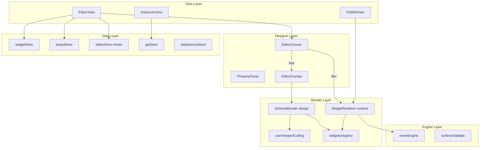

# Editor Architecture

> `@editor` - Vue 3 visual form / page / dashboard editor
> **Doc version**: v3 (2026-07-20) - aligned with post-E1 code (viewport culling, immer, registry-based types, dashboard demo)

---

## 1. Project Structure

```
editor/
├── src/
│   ├── views/               # route pages
│   ├── components/
│   │   ├── Editor/          # designer UI
│   │   └── WidgetRenderer/  # runtime / canvas rendering
│   ├── widgets/             # 86 directories, 97 registerWidget
│   ├── stores/              # 12 Pinia stores
│   ├── composables/         # 59 composables
│   ├── engine/              # eventEngine
│   ├── api/                 # 11 domain APIs
│   ├── utils/               # templates, themes, demo, coords…
│   ├── locales/             # i18n language packs
│   └── workers/             # IndexedDB / cache
├── docs/                    # product & architecture docs
└── package.json             # @editor · port 5100
```

| Package | Port | Dependencies |
|---|---|---|
| `@editor` | 5100 | `@schema-platform/platform-shared` |

---

## 2. Layered Architecture



---

## 3. Dual-path Rendering

| Path | Entry | Layout | Use case |
|------|------|------|------|
| SchemaRender -> SchemaNode | EditorCanvas (free) | Absolute positioning | Design-time canvas |
| WidgetRenderer -> WidgetNode | EditorCanvas (flex) / PublishView | Flow | Preview / publish / Flex page |

### Viewport Culling (free design-time only)

1. `EditorView` computes `ViewportRect` from the canvas scroll container, `provide(VIEWPORT_CULLING_KEY)`
2. `SchemaRender` renders a placeholder div for out-of-viewport widgets and `SchemaNode` for in-viewport ones
3. **EditorOverlay hit-testing is still based on full widget data**, independent of whether the DOM is mounted

---

## 4. Widget System

| File | Responsibility |
|------|------|
| `config.ts` | Metadata, propertyPanel, configPanels |
| `FgXxx.vue` | Runtime component |
| `index` / factory | `createXxxWidget(id)` |
| `registry.ts` | `registerWidget` / `createWidgetPlugin` / `getComponentMap` |

- **`SchemaType = string`** (registry is the runtime source of truth; `KnownSchemaType` is for docs/fallback only)
- Groups: layout · form · container · table · action · static · business · chart
- Extension: see [third-party-widget-guide.md](./third-party-widget-guide.md)

---

## 5. Schema JSON

```typescript
{
  widgets: Widget[]
  board: {
    canvas: CanvasConfig  // layoutMode, themePreset, zoom, freeLayout…
    variables: BoardVariable[]
    events: BoardEvent[]
    pages?: BoardPage[]   // multi-page (optional)
  }
}
```

Dashboard seed: `utils/dashboardDemo.ts` -> `createBoardFromTemplate({ layoutMode: 'free', freePreset: 'dashboard-demo' })`

---

## 6. Pinia Stores (12)

| Store | Responsibility |
|-------|------|
| widget | Widget tree, reparent, layout adaptation |
| editor | Selection, InteractionMode, immer history, clipboard |
| board | Canvas, theme, variables, events, multi-page |
| drag | Drag, guides, collision preview |
| api | Schema CRUD / publish |
| dataSource | Global data source definitions |
| app | Runtime user/request/global |
| request | HTTP cache |
| schemaVersion | Version comparison |
| template | Templates |
| credential | Credentials |
| tenant | Tenant |

### Undo/Redo

`editorStore` uses immer `enablePatches`: the history stack stores `patches` / `inversePatches`; `resetHistory()` on schema load.

---

## 7. Composable Highlights (46)

| Domain | Representatives |
|------|------|
| Drag / Resize | useDrag, useResize, useFlexCanvasDrop |
| Viewport / Align | useViewportCulling, useWidgetAlignment |
| Linkage / Events | useLinkage, useChartEvents, useEventLog |
| Data | useDataSource, useDynamicOptions, useFormData |
| Layout | useBoardLayout, useEditorLayout |
| Mode | useModeControl, useInteractionControl |
| History | useHistory (generic snapshot; main canvas uses editorStore) |

---

## 8. Four Config Systems

| System | Field | Description |
|------|------|------|
| Events | `events` | eventEngine multi-action |
| Linkage | `linkages` | visible/disabled/required/options/set-value/reset-fields |
| API | `api` | Dynamic data; can attach dataSourceId |
| Variables | `variables` | Widget / Board variables |

Property panel: `PropertyPanel` + `PropertyPanelSections` + `PropertyPanelConfigBar`.

---

## 9. Interaction Modes

`INTERACTION_MODES`: `edit` | `preview` | `publish-interactive` | `publish-readonly`

- Switchable from the designer toolbar
- PublishView: `?interaction=readonly|interactive`; optional `showModeToggle=1`

---

## 10. Observability & i18n

| Module | Location | Description |
|------|------|------|
| telemetry | platform-shared | `track` / `reportError`; buffers to localStorage when server is missing |
| i18n | platform-shared `createI18n` | editor `locales/editor-*.ts`; progressive UI adoption |

---

## 11. Stats Baseline (2026-07-20)

| Metric | Count |
|------|------|
| Store | 12 |
| Composable | 46 |
| Widget directories | 86 |
| registerWidget | 97 |
| Vitest specs | 99 |
| API | 11 |

---

## Related Docs

- [Capabilities](./capabilities.md)
- [Doc index](./README.md)
- [Product closure](./iteration-evolution.md) (internal)
- Root [README](../README.md)
