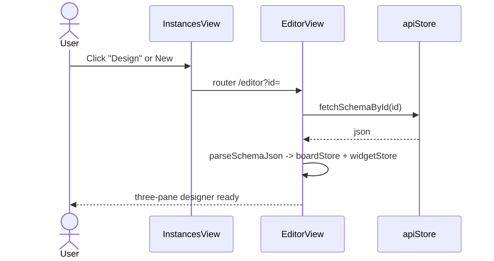
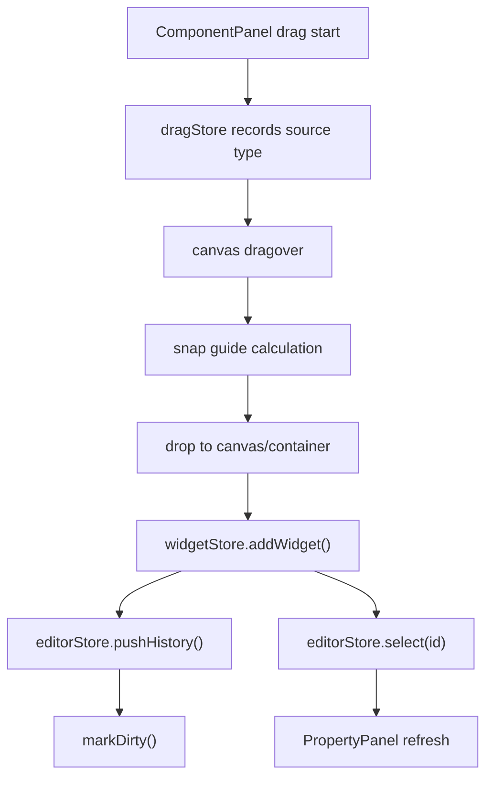
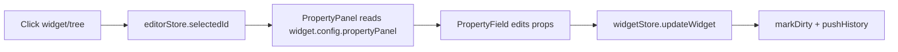
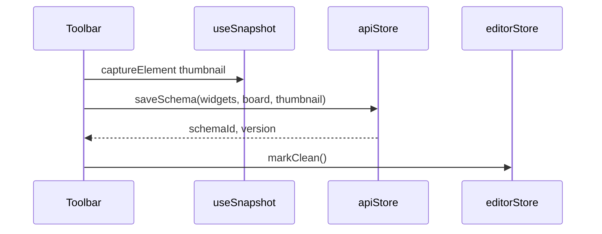
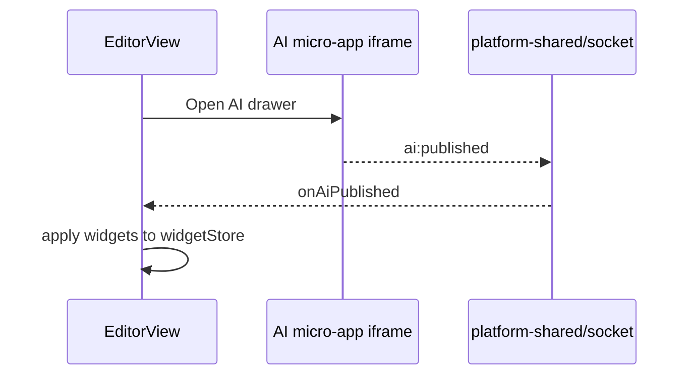

# Editor Designer - Design Draft & Interaction Flow

## 1. Wireframe (EditorView)

```
┌──────────────────────────────────────────────────────────────────────────┐
│ EditorViewToolbar                                                        │
│ [Save] [Publish] [Undo/Redo] [Zoom] [Validate▾] [Preview] [AI]  Name: [___]│
├──────────┬───────────────────────────────────────────────┬───────────────┤
│ LeftPanel│ Canvas                                        │ PropertyPanel │
│ 240px    │                                               │ 320px         │
│          │  ┌─ EditorRuler ─────────────────────────┐   │               │
│ [Library]│  │ EditorCanvas                          │   │ ▼ Basic       │
│ [Tree]   │  │  SchemaRender + EditorOverlay         │   │   label/field │
│ [Template│  │  (selection/drag/resize/context menu) │   │ ▼ Style       │
│          │  └───────────────────────────────────────┘   │ ▼ Events/Link │
│          │  ZoomIndicator | EventLogDrawer              │ ▼ Rules/API   │
│          │  [optional AI iframe drawer]                 │               │
└──────────┴───────────────────────────────────────────────┴───────────────┘
```

---

## 2. Core Interaction Flows

### 2.1 Enter Designer from List



### 2.2 Drag to Add Widget



### 2.3 Select & Edit Properties



`visibleOn` expressions control property field visibility.

### 2.4 Undo/Redo

```
editorStore.history[] stores widget snapshots
  undo -> restore history[index-1] -> widgetStore.widgets =
  redo -> reverse
```

### 2.5 Save



Auto-save: `useAutoSave` debounces 60s after a dirty flag.

### 2.6 Validation (non-blocking)

```
Toolbar "Validate" -> useSchemaValidation.runValidation()
  -> schemaValidate.ts static rules + reference integrity
  -> results shown in a Popover (does not block save)
```

### 2.7 Preview Mode

```
Toolbar "Preview" -> editorStore.mode = 'preview'
  -> EditorOverlay hides edit handles
  -> widgets render with runtime behavior (still on editor surface)
```

---

## 3. Canvas Layout Modes

| Mode | `board.canvas.layoutMode` | Behavior |
|------|---------------------------|------|
| Free | `free` | Absolute positioning; EditorOverlay drag / resize / guides (see §2.2) |
| Flex | `flex` | Flow WidgetRenderer; `useFlexCanvasDrop` + column zone `FlexColDropZone` |

### 3.1 Flex Edit Interaction (verified update 2026-07-22)

Implemented (former "gaps" all landed):
- Root drop + Y insertion index (`useFlexCanvasDrop`) + insertion indicator (`renderFlexInsertIndicator`, blue before/after indicator)
- In-container drop (`useFlexDropZone`): form/card/tabs/row-container receive children; tabs/col filter index maps back to full (`mapFilteredIndexToFull`)
- Drag reorder: drag existing widgets to swap (`source: 'canvas'` -> `moveWidgetToIndex`)
- Flex resize: WidgetNode right-edge 6px resize handle, drag changes `style.width` (px)
- `span` 24-grid: row-container children allocated `flex-basis` by `span` (1-24); PropertyPanel Flex section configurable
- Container nesting max 2 levels (`MAX_CONTAINER_DEPTH`, aligned with [container-nesting-decision.md](../container-nesting-decision.md))
- Context menu (`WidgetContextMenu`, flex standalone instance): copy/copy-ID/to-top/to-bottom/lock/hide/delete + open events/linkage/API/variables config
- Selection box (`editorShellSelected` blue outline) + hover outline + hidden semi-transparent dashed
- Multi-select (shift+click `toggleSelect`) + batch delete
- Keyboard shortcuts (not mode-gated): Delete/Backspace delete, Ctrl+C/V copy/paste, Ctrl+Z/Y undo/redo, Ctrl+Alt+L/H lock/hide, **Ctrl+↑/↓ move forward/backward among siblings** (flex flow reorder, `editorStore.performMoveSelected`)
- Canvas zoom (`transform: scale`)
- ComponentPanel filters flex-available widgets by `availableIn`/`contexts`

Free-only (meaningless for flex, correctly isolated): absolute-coord align/distribute (Alt+Shift+L/R/C/H/V), EditorOverlay 8-way resize, grid snap, EditorRuler, canvas px width/height config.

Honest verdict: Flex is now a **complete flow designer** on par with free, covering drop-in/reorder/resize/grid/nesting/context-menu/shortcuts/multi-select/zoom. The remaining differences are dictated by the layout model itself (flow vs absolute), not feature gaps.

---

## 4. Config Dialogs

Standalone dialogs opened from the PropertyPanel:

| Dialog | Config |
|--------|------|
| EventConfigDialog | Widget events -> action chain |
| LinkageSchemaDialog | Field linkage |
| OptionsApiConfigDialog | Option data-source API |
| VariableConfigDialog | Page variables |
| RulesEditor | Validation rules |

---

## 5. AI Integration



---

## 6. Leave Guard

```
router beforeEach: leaving /editor && isDirty
  -> ElMessageBox confirm
  -> cancel aborts navigation
```
