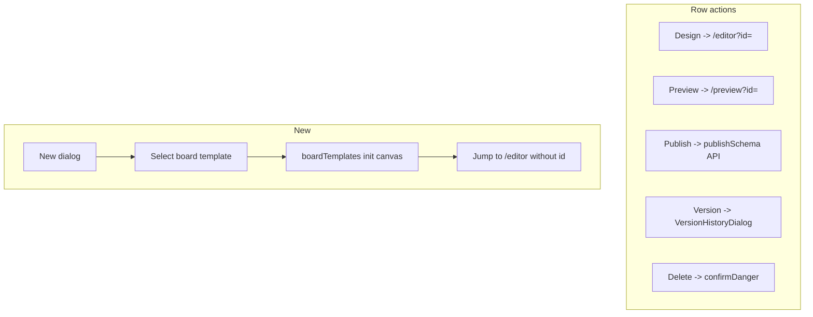
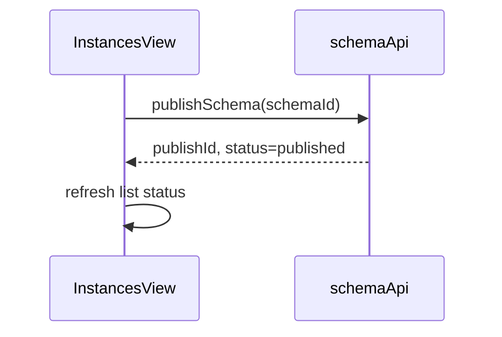
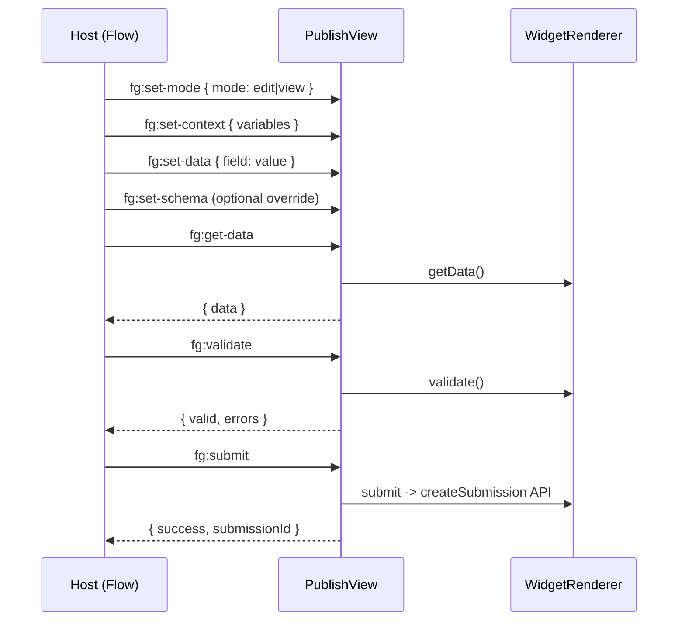
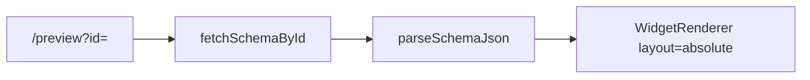
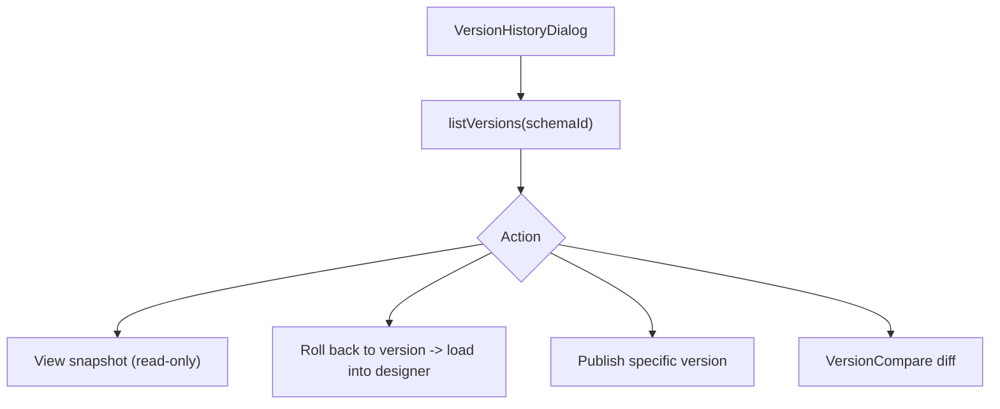
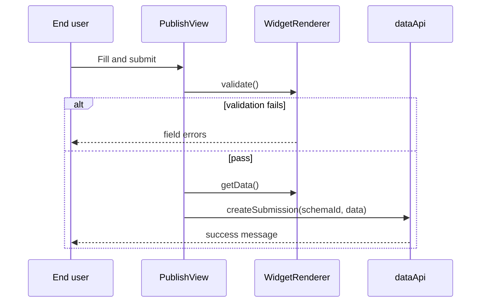

# Editor Instances & Publish - Design Draft & Interaction Flow

## 1. Instance List Wireframe (InstancesView)

```
┌──────────────────────────────────────────────────────────────────────────┐
│ Form instances                        [+ New] [Import] [Export]           │
├──────────────────────────────────────────────────────────────────────────┤
│ 🔍 Search...    Filter: [All▾] [Draft] [Published]                       │
├──────────────────────────────────────────────────────────────────────────┤
│  Name            Status    Updated        Actions                       │
│  User Register   Published 2h ago    [Design][Preview][Publish][Version][Delete]│
│  Leave Request   Draft     yesterday [Design][Preview][Publish] ...     │
└──────────────────────────────────────────────────────────────────────────┘
```

---

## 2. List Action Flow



### Publish (from list)



---

## 3. Publish Runtime Wireframe (PublishView)

```
┌──────────────────────────────────────────────────────────────────────────┐
│ [Optional top bar] Form title                           mode: edit/view  │
├──────────────────────────────────────────────────────────────────────────┤
│                                                                          │
│                    WidgetRenderer (runtime surface)                      │
│                    Form field render + linkage + validation              │
│                                                                          │
├──────────────────────────────────────────────────────────────────────────┤
│ [Submit] [Reset]                                                        │
└──────────────────────────────────────────────────────────────────────────┘
```

### Access

| URL | Load API |
|-----|----------|
| `/view/:schemaCode` | `fetchPublishedByCode` |
| `/view?id=publishId` | `fetchPublishedByPublishId` |

---

## 4. postMessage Embedding Protocol

External hosts (Flow UserTask, micro-app container) embed PublishView via iframe:



| Message | Direction | Description |
|------|------|------|
| `fg:set-mode` | Host -> Editor | Edit/read-only/partial-edit |
| `fg:set-context` | Host -> Editor | Inject process variables |
| `fg:set-data` | Host -> Editor | Prefill form data |
| `fg:get-data` | Host -> Editor | Read current form values |
| `fg:validate` | Host -> Editor | Trigger field validation |
| `fg:submit` | Host -> Editor | Submit to server |
| `fg:reset` | Host -> Editor | Reset form |

Implementation: `editor/src/microapp/bridge.ts` + `PublishView.vue`.

---

## 5. Draft Preview (PreviewRenderView)



Difference from PublishView: loads the **draft** API; no submit/publish constraints.

---

## 6. Version Management



Query params `?editId=&version=` open a historical version directly for editing.

---

## 7. Submit Flow (runtime)



Optional: the event engine `submit` action triggers `startFlow` to start an associated flow.
