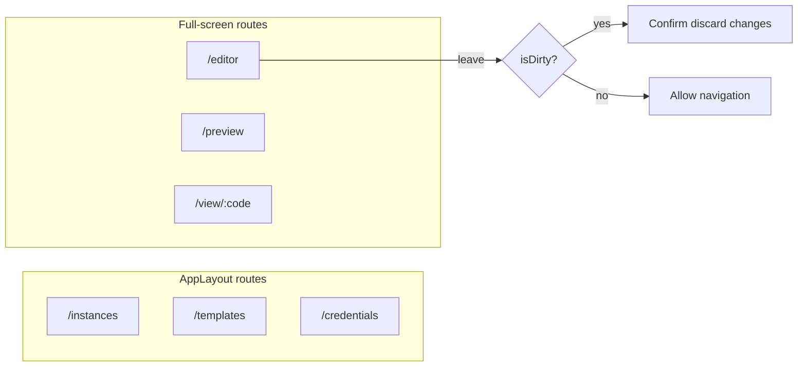
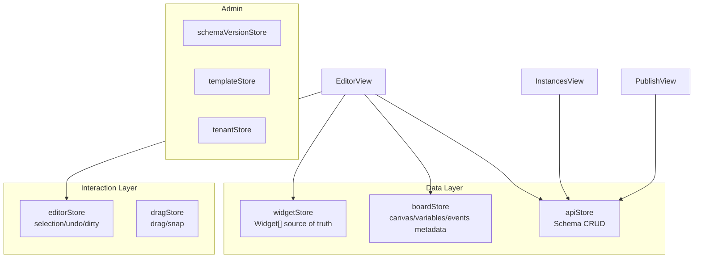
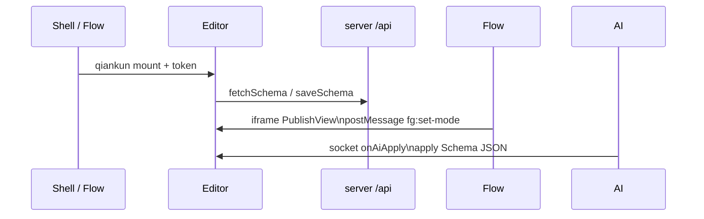

# Editor Information Architecture & Layout

## 1. App Shell

### 1.1 Standalone Mode

```
┌──────────────────────────────────────────────────────────────────────────┐
│ AppLayout                                                                │
├────────────┬─────────────────────────────────────────────────────────────┤
│ Sidebar    │  Main content                                               │
│            │                                                             │
│ Instances  │                                                             │
│ Templates  │                                                             │
│ Credentials│                                                             │
│ Tenants    │                                                             │
│ Submissions│                                                             │
│ Widget docs│                                                             │
└────────────┴─────────────────────────────────────────────────────────────┘
```

### 1.2 Full-screen Pages (no sidebar)

| Route | View | Use case |
|------|------|------|
| `/editor?id=` | `EditorView` | Visual designer |
| `/preview?id=` | `PreviewRenderView` | Draft preview |
| `/view/:schemaCode` | `PublishView` | Published runtime |

### 1.3 qiankun Embedding

- Sub-app name: `editor`, dev port **5100**
- When embedded, `useQiankunShell().shouldHideSubAppMenu` hides the sidebar
- The shell injects `getToken`, `getRouteBase`
- Standalone access fallback: auto-start if not mounted within 500ms

---

## 2. Routes & Guards



**Editor query params**:

| Param | Description |
|------|------|
| `id` | Schema draft ID |
| `editId` + `version` | Open a historical version |

---

## 3. Store Relationships



**11 Pinia stores in practice** (see [runtime.md](./runtime.md) for details).

---

## 4. Platform Integration



| Integration | Mechanism |
|--------|------|
| Shell | qiankun micro-frontend |
| Flow | UserTask embeds `/view/:publishId` |
| AI | WebSocket applies generated results |
| External host | PublishView postMessage protocol |

---

## 5. Three-surface Runtime Comparison

| Surface | Route | Data | Renderer |
|------|------|------|--------|
| Designer | `/editor` | Draft (memory + API) | EditorCanvas -> SchemaRender |
| Draft preview | `/preview` | `fetchSchemaById` | WidgetRenderer |
| Published | `/view/:code` | `fetchPublishedByCode` | WidgetRenderer + submit |

See [instances-publish.md](./instances-publish.md), [runtime.md](./runtime.md).
