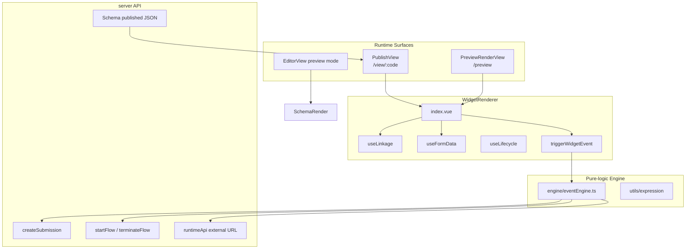
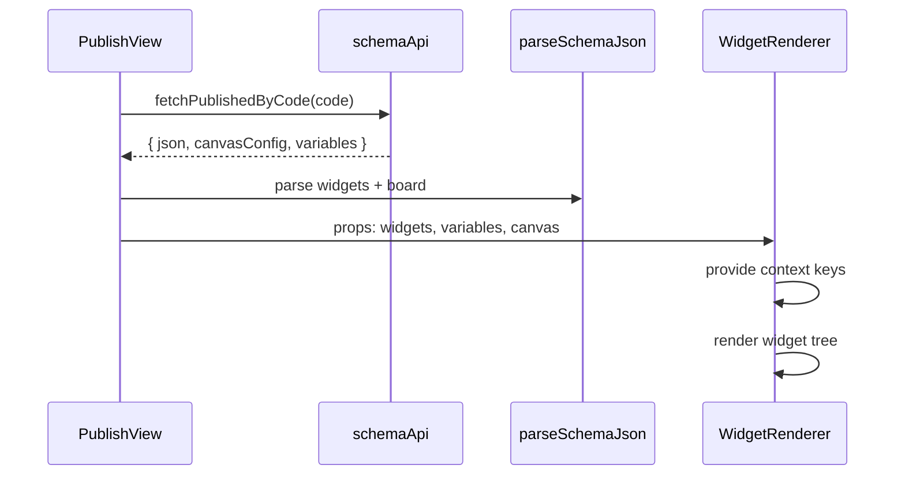
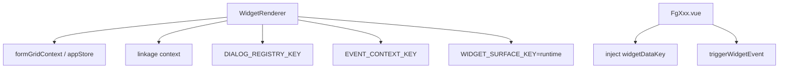
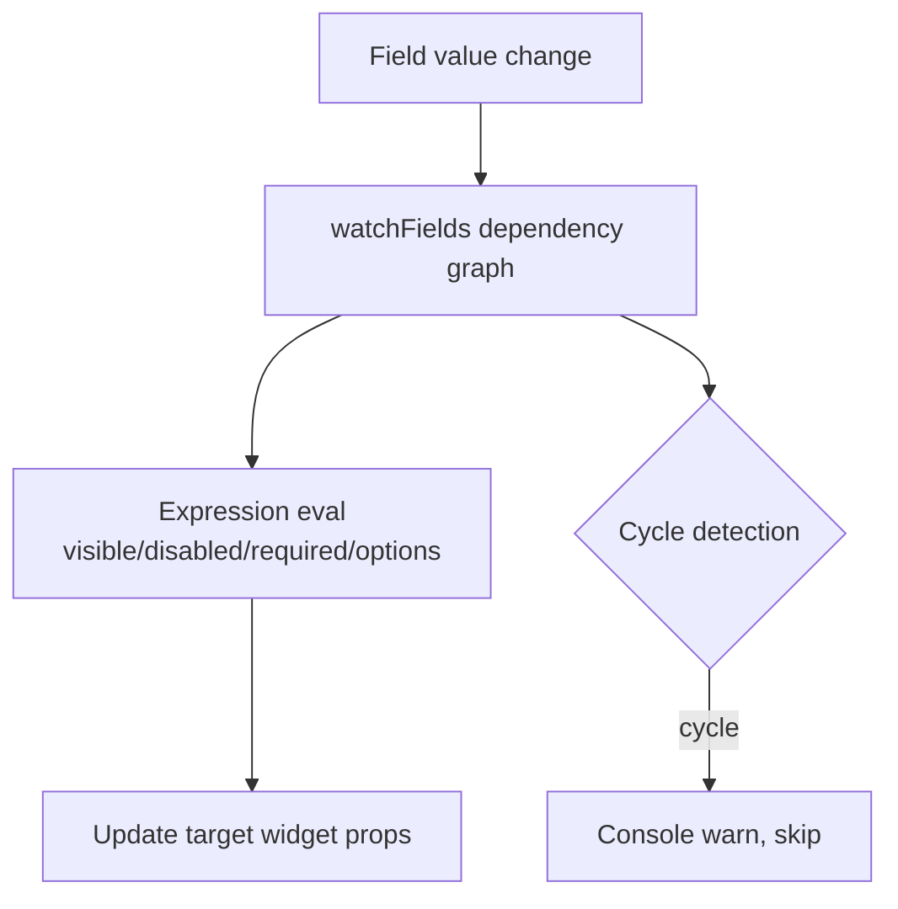
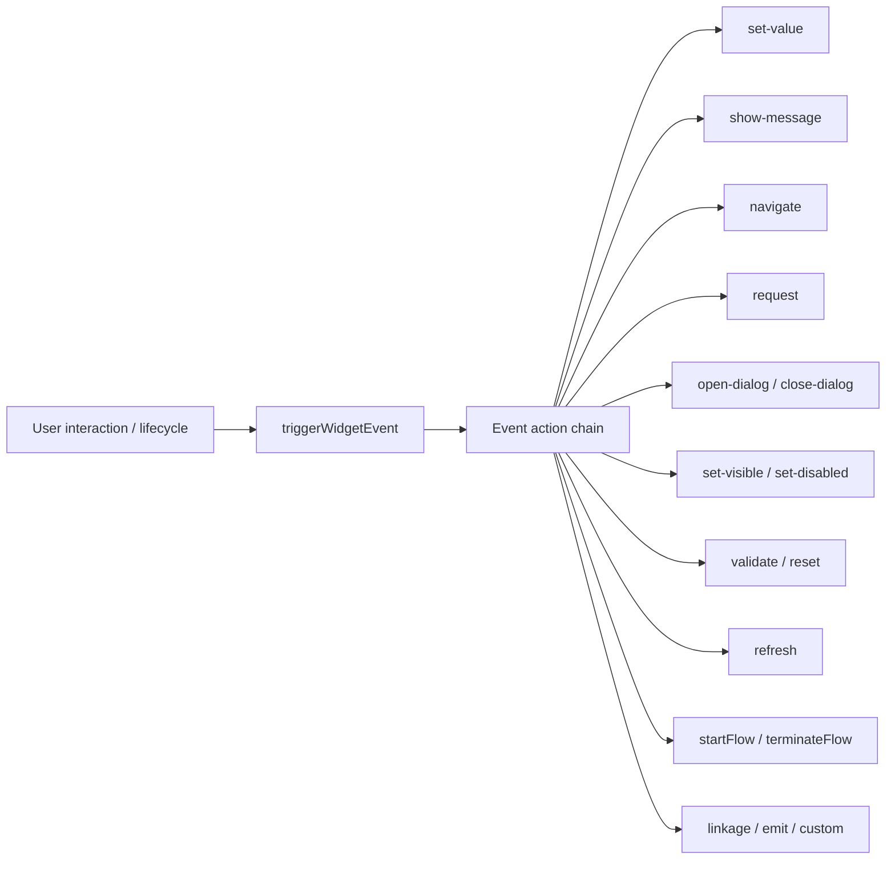
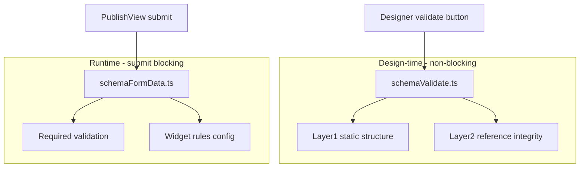
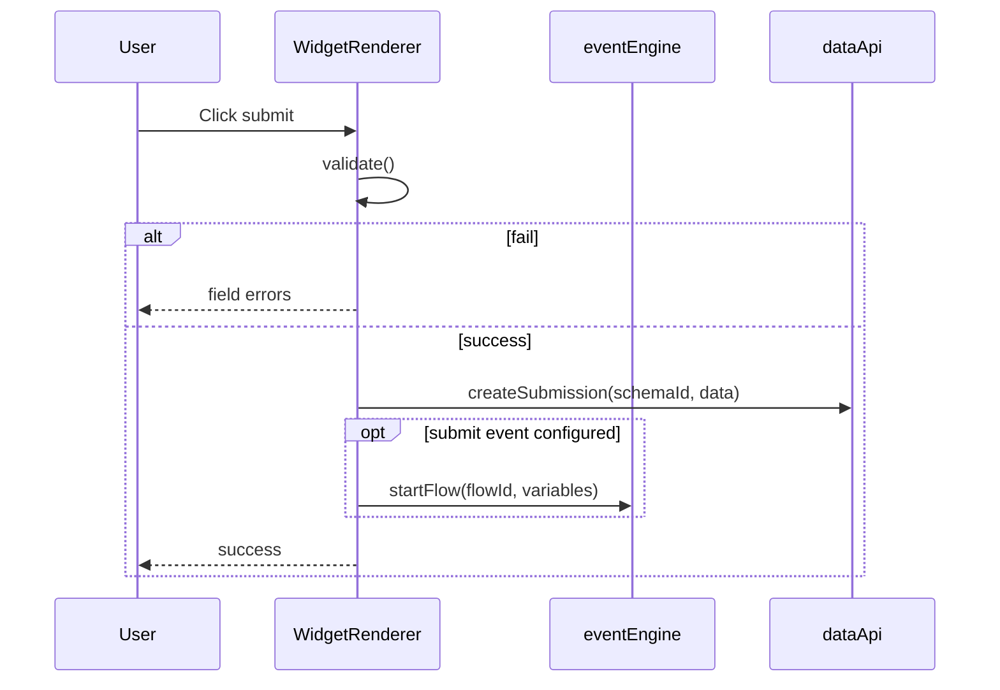
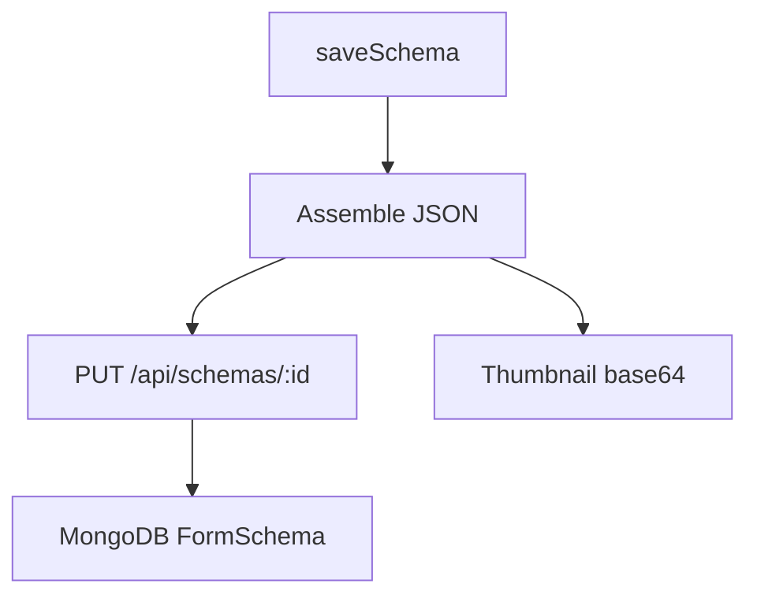

# Editor Runtime Architecture

> WidgetRenderer, event engine, linkage, validation - design-time vs runtime execution paths

---

## 1. Runtime Overview



---

## 2. Surface Contract

| Surface | `WIDGET_SURFACE_KEY` | Mock data | Use case |
|---------|---------------------|-----------|------|
| Designer canvas | `'editor'` | ✅ `mock.ts` | Drag orchestration |
| Runtime | `'runtime'` | ❌ | Real user form filling |

Widget components get data via `inject(widgetDataKey)`; **do not** read Pinia stores directly.

---

## 3. Schema Load Runtime



### Schema JSON Format

```typescript
{
  widgets: Widget[],           // widget tree
  board: {
    canvas: { width, height, layoutMode, zoom, ... },
    variables: BoardVariable[],
    events: BoardEvent[],      // page-level events
  }
}
```

`parseSchemaJson` is backward-compatible with the old format (plain `Widget[]` array).

---

## 4. WidgetRenderer Runtime

### 4.1 Provide / Inject Keys



### 4.2 Exposed API (for PublishView / postMessage)

| Method | Description |
|------|------|
| `getData()` | Collect all field values |
| `setData(data)` | Batch assign |
| `validate()` | Field-level validation |
| `submit()` | Validate + submit |
| `reset()` | Reset form |

---

## 5. Linkage Runtime (useLinkage)



Linkage config comes from the widget `config.linkage` or LinkageSchemaDialog.

---

## 6. Event Engine Runtime

`engine/eventEngine.ts` - **pure functions**, no Vue dependency.



### EventExecutionContext Injection

```typescript
{
  getFormData, setFormData,
  getVariable, setVariable,
  apiClient, navigate,
  openDialog, closeDialog,
  showMessage, ...
}
```

---

## 7. Validation Runtime (two layers)



---

## 8. Submit Flow Runtime



---

## 9. Save Runtime (designer)



Auto-save: `useAutoSave` watches `editorStore.isDirty`, 60s debounce.

---

## 10. API Runtime Path

```
Widget/Store/Composable
        ↓
src/api/*.ts
        ↓
utils/apiClient.ts (Bearer token, retry, mock)
        ↓
server /api/*
```

| Runtime scenario | API module |
|------------|----------|
| Form submit | `dataApi.createSubmission` |
| Dict/options | `widgetApi` |
| External URL | `runtimeApi.fetchRuntimeUrl` |
| Flow trigger | `dataApi.startFlow` |
| Approval log | `flowApi` |

---

## 11. Pinia Store Runtime Participation

| Store | Design-time | Runtime (PublishView) |
|-------|--------|---------------------|
| widgetStore | ✅ | ❌ (passed as props) |
| boardStore | ✅ | ❌ |
| editorStore | ✅ | ❌ |
| appStore | Partial | ✅ formGridContext |
| apiStore | ✅ persistence | ✅ load published |

---

## 12. Constraint Quick Reference

| Constraint | Description |
|------|------|
| Widgets don't read Store | Runtime via inject |
| Published read-only API | PublishView doesn't use draft API |
| Event engine pure function | Unit-testable, context injection |
| apiClient unified exit | Components must not fetch directly |

---

## Related Docs

- [designer.md](./designer.md) - designer UI interaction
- [instances-publish.md](./instances-publish.md) - publish & embedding
- [../architecture.md](../architecture.md) - component architecture
- [../widget-development.md](../widget-development.md) - widget development
