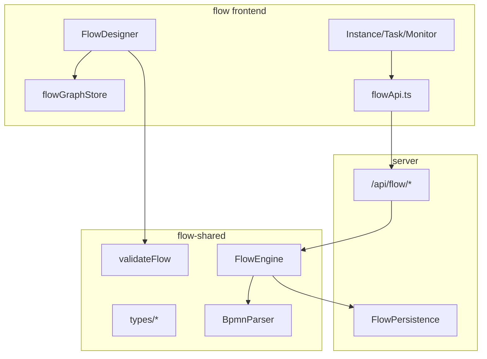

# Flow Architecture

> `@flow` + `@schema-platform/flow-shared` - BPMN process designer and execution engine

**Doc version**: v1 (2026-07-06)

---

## 1. Project Structure

```
flow/                          # Frontend UI (@flow)
├── src/
│   ├── components/            # FlowDesigner, FlowCanvas, nodes, nodePanels
│   ├── stores/                # 7 Pinia stores
│   ├── composables/           # simulation, layout, cross-node data
│   ├── api/flowApi.ts         # unified API
│   └── views/                 # list, instance, task, monitor

flow-shared/                   # Shared engine (@schema-platform/flow-shared)
├── src/types/                 # BPMN, Graph, Instance, Monitor
└── src/engine/
    ├── FlowEngine.ts          # Token execution engine
    ├── BpmnParser.ts
    ├── FlowValidator.ts
    └── ExpressionEvaluator.ts
```

| Package | Port | Responsibility |
|---|---|---|
| `@flow` | 5200 | BPMN designer, instance/task UI |
| `flow-shared` | - | Types, validation, **server-side execution engine** |

---

## 2. Layered Architecture



**Boundary**: the frontend does **not** import `FlowEngine`; execution happens on the server.

---

## 3. BPMN Nodes

- **Enum**: `BpmnElementType` - 25 types (flow-shared)
- **UI implementation**: 13 types (panels + renderers)
- **Engine executors**: Start/End, User/Service/Script Task, three Gateway types, Timer, SubProcess, CallActivity

Type mapping: `flowGraphStore` maintains Vue Flow type ↔ BPMN type.

---

## 4. FlowGraph Data Model

```typescript
interface FlowGraph {
  nodes: FlowNodeData[]   // id, type, position, config: BpmnNodeConfig
  edges: FlowEdgeData[]   // source, target, condition, isDefault
  metadata?: { ... }
}
```

Persistence: `FlowVersion.graph` (design-time) -> used by `FlowEngine.startInstance` after publish.

---

## 5. Design-time vs Runtime

| | Design-time | Runtime |
|--|--------|--------|
| Location | flow frontend | server + flow-shared |
| State | Vue Flow nodes/edges | FlowInstanceData + tokens |
| Validation | `validateFlow` client-side | re-validated before engine start |
| Simulation | `useSimulation` | real API polling visualization |
| Form | MicroFormEmbed preview | task form iframe |

---

## 6. Pinia Stores (7)

| Store | Responsibility |
|-------|------|
| `flowGraphStore` | nodes/edges <-> FlowGraph serialization |
| `flowDesignerStore` | selection, undo, dirty, preview mode, validation highlight |
| `flowDefinitionStore` | flow definition CRUD, publish |
| `flowInstanceStore` | instance, task, approval actions |
| `flowMonitorStore` | monitor dashboard data |
| `flowTemplateStore` | flow templates |
| `notificationStore` | unread notifications |

---

## 7. Integration

| Consumer | Approach |
|--------|------|
| Shell | qiankun sub-app `flow` |
| Editor | UserTask embedded in PublishView; `/embed/*` |
| AI | iframe + `onAiApply` writes to graph |
| Server | FlowEngine executes instances |

---

## 8. Doc Index

### Design & Runtime

- [Design index](./design/README.md)
- [Information architecture](./design/overview.md)
- [Process designer](./design/designer.md)
- [Instances & tasks](./design/instances-tasks.md)
- [**Runtime architecture**](./design/runtime.md)

### Project

- [README](./README.md) - feature list and dev commands
