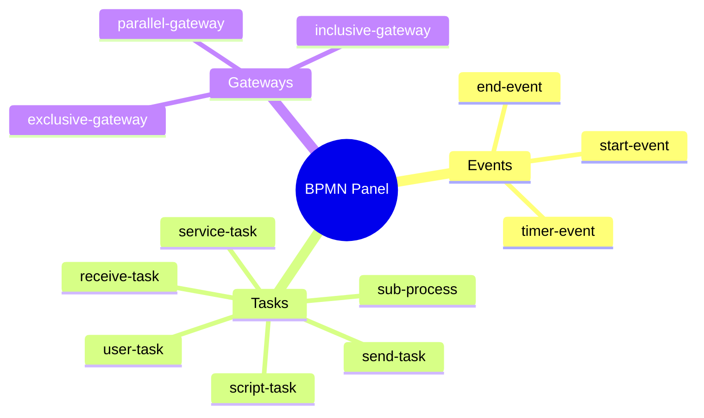
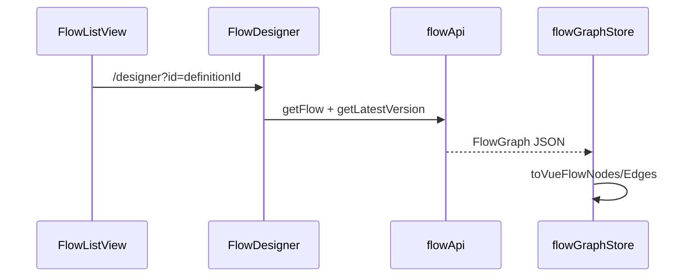
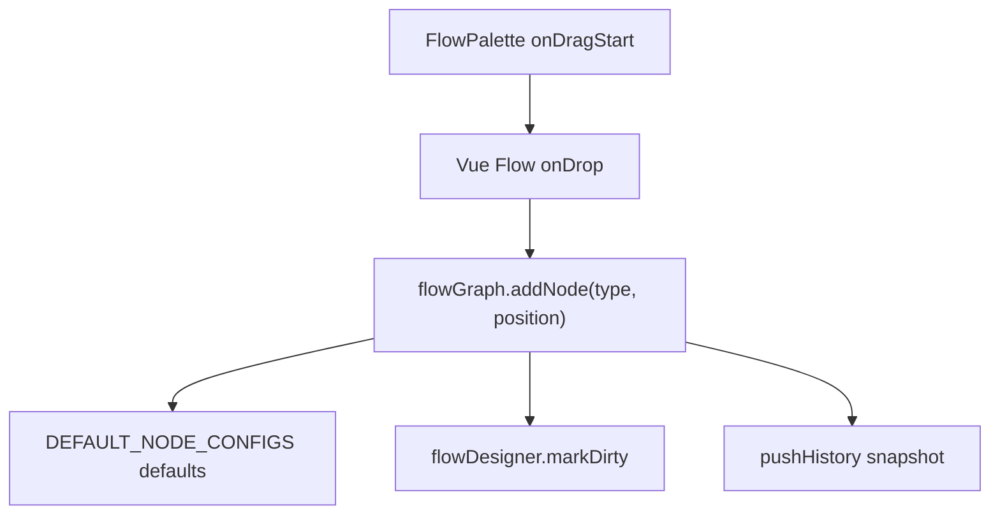
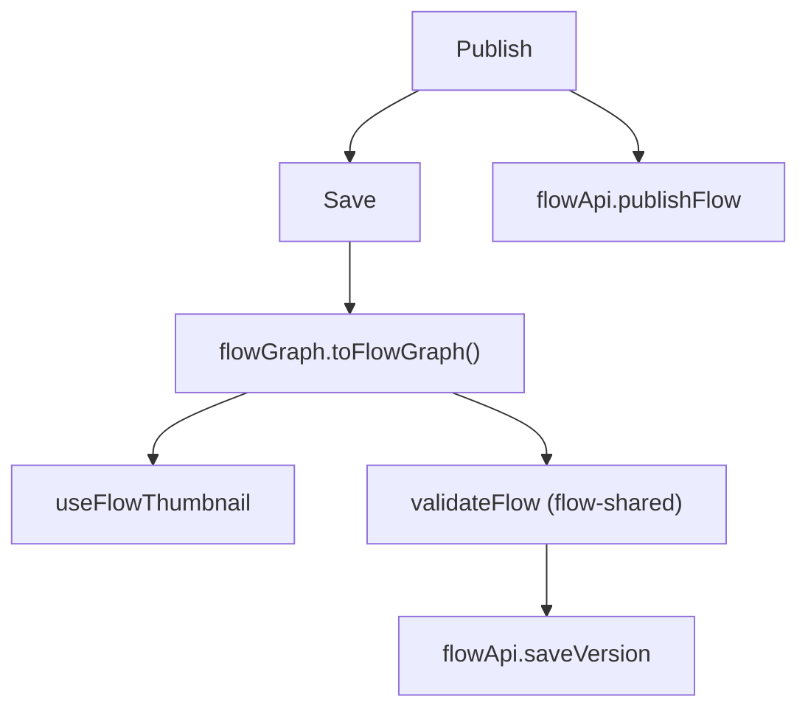
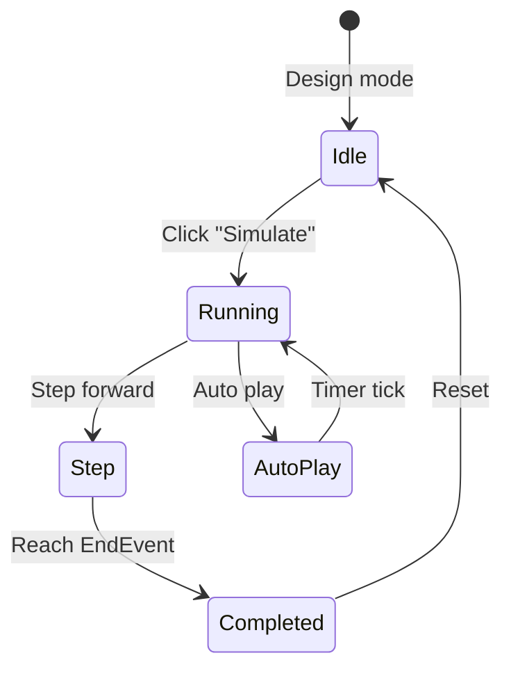
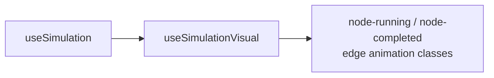
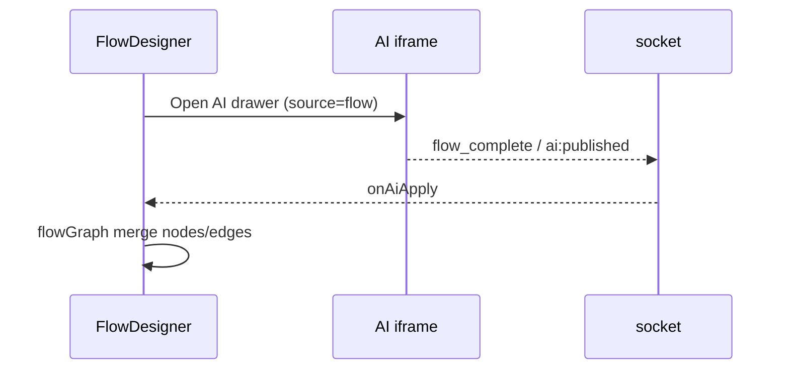

# Flow Process Designer - Design Draft & Interaction Flow

## 1. Wireframe (FlowDesigner)

```
┌──────────────────────────────────────────────────────────────────────────┐
│ FlowToolbar                                                              │
│ [Save] [Publish] [Undo/Redo] [Validate] [Auto Layout] [Sim▶] [Export]   Flow name [___] │
├──────────┬───────────────────────────────────────────────┬───────────────┤
│ Palette  │ FlowCanvas (Vue Flow)                         │ PropertyPanel │
│ 240px    │                                               │ 320px         │
│          │  Background + Controls + MiniMap              │ label         │
│ ▼ Events │  Custom node slot × 13                        │ documentation │
│  Start/End│  AnimatedEdge                                │ nodePanel(*)  │
│ ▼ Tasks  │  snap grid                                    │ out-edge      │
│  User/Service│                                            │ conditions    │
│ ▼ Gateways│                                               │               │
│          │                                               │               │
├──────────┴───────────────────────────────────────────────┴───────────────┤
│ Optional: AI drawer (400px) | Form preview MicroFormEmbed                │
└──────────────────────────────────────────────────────────────────────────┘
```

---

## 2. Implemented Nodes (13)



The `BpmnElementType` enum has 25 types total; the rest are reserved for forward compatibility.

---

## 3. Core Interaction Flows

### 3.1 Open Designer



### 3.2 Drag to Add Node



### 3.3 Connect

```
onConnect -> flowGraph.addEdge
  -> gateway out-edges can configure condition / isDefault
  -> AnimatedEdge rendering
```

### 3.4 Property Editing

| Node type | Panel component |
|----------|----------|
| `user-task` | UserTaskPanel (assignees, form binding, reject policy) |
| `service-task` | ServiceTaskPanel (HTTP/API) |
| `script-task` | ScriptTaskPanel |
| `*-gateway` | GatewayConditionPanel |
| `sub-process` | SubProcessPanel |

`useNodePropertyPanel` registers the type -> panel mapping.

### 3.5 Save & Publish



Validation failures show the error node ID list in the toolbar.

### 3.6 Auto Layout

```
useAutoLayout (dagre)
  -> recompute node positions
  -> fitView
```

### 3.7 Design / Preview Mode Toggle

| Mode | Sidebar | Canvas |
|------|------|------|
| `design` | Visible | Editable |
| `preview` | Hidden | Read-only |

---

## 4. Simulation (Design-time)



**Note**: simulation does not call the server-side FlowEngine; gateway conditions are simplified.



---

## 5. Form Preview

When a UserTask binds `formPublishId`:

```
PropertyPanel -> "Preview form"
  -> MicroFormEmbed iframe
  -> Editor /view/:publishId
  -> postMessage fg:set-mode
```

---

## 6. AI Integration



---

## 7. BPMN Import / Export

```
Toolbar export -> exportToBpmnXml(graph)
Toolbar import -> importFromBpmnXml -> flowGraph.load
```

Provided by `flow-shared`; validated in the designer before writing to a version.
