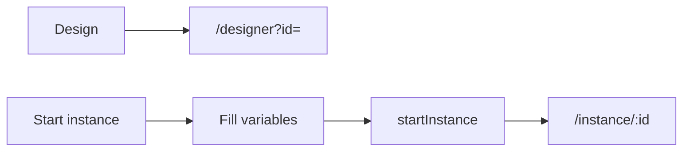
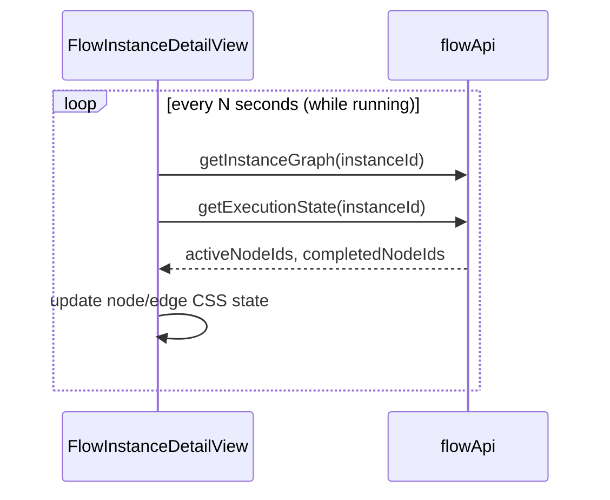
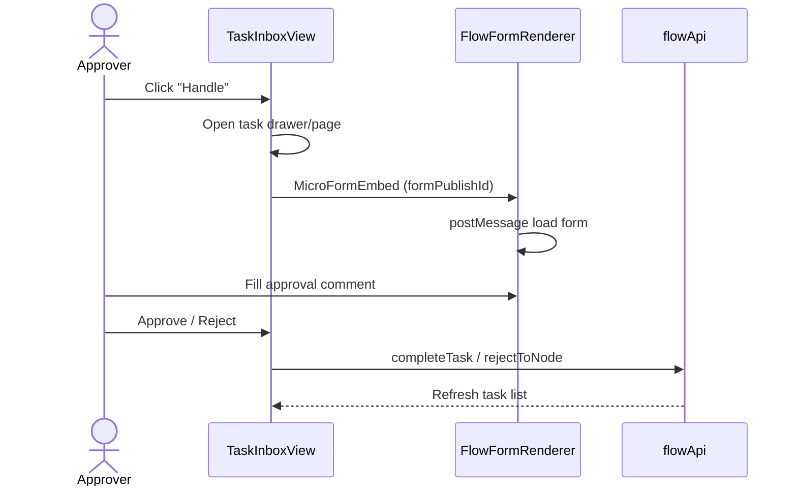
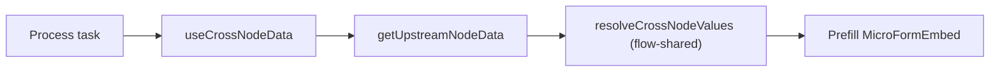
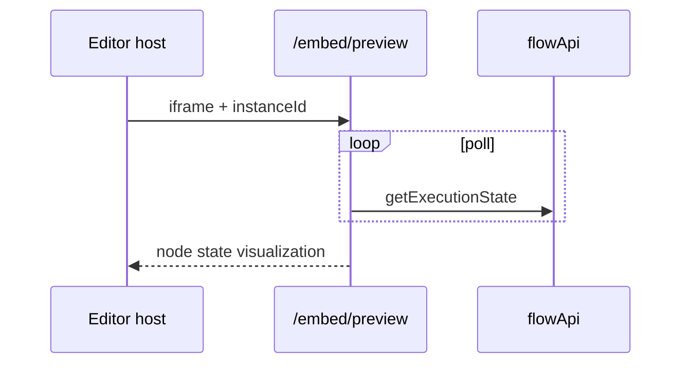
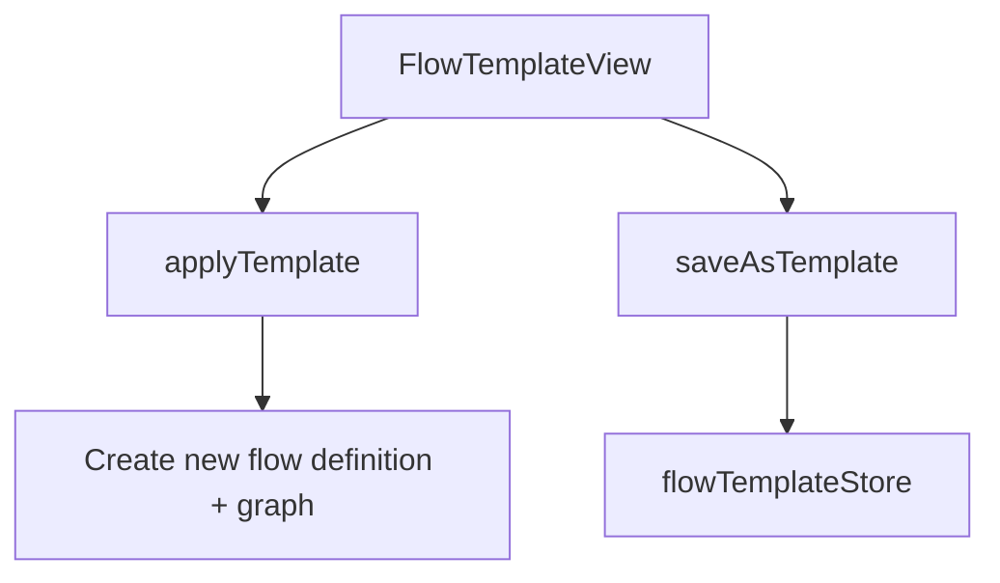

# Flow Instances & Tasks - Design Draft & Interaction Flow

## 1. Flow List (FlowListView)

```
┌──────────────────────────────────────────────────────────────────────────┐
│ Flow definitions                        [+ New] [From Template]          │
├──────────────────────────────────────────────────────────────────────────┤
│  Name          Status     Version   Actions                             │
│  Leave approval Published  v3       [Design] [Instances] [Publish] [Delete] │
│  Purchase req   Draft      v1       [Design] ...                        │
└──────────────────────────────────────────────────────────────────────────┘
```



---

## 2. Instance Detail Wireframe (FlowInstanceDetailView)

```
┌──────────────────────────────────────────────────────────────────────────┐
│ ← Back │ Leave approval #12345  ● Running  │ [Terminate] [Suspend] [Recall] │
├──────────────────────────────────────────────────────────────────────────┤
│                                                                          │
│   FlowGraphPreview (Vue Flow read-only)                                  │
│   Node colors: completed(green) / active(blue) / waiting(orange)         │
│   Edge animation: edgeRuntimeState                                       │
│                                                                          │
├──────────────────────────────┬───────────────────────────────────────────┤
│ Approval log Timeline        │ Process variables JSON                    │
│ Node duration                │ Refresh button                            │
└──────────────────────────────┴───────────────────────────────────────────┘
```

### Runtime Graph Polling



**The frontend does not execute FlowEngine** - state comes entirely from server APIs.

---

## 3. Task Inbox (TaskInboxView)

```
┌──────────────────────────────────────────────────────────────────────────┐
│ My tasks                   [Batch Approve] [Batch Reject]                │
├──────────────────────────────────────────────────────────────────────────┤
│  Tabs: [Pending] [Done] [Initiated by me]                                │
├──────────────────────────────────────────────────────────────────────────┤
│  ☐ Leave request - Manager approval  Initiator: Zhang   2h ago   [Handle]│
│  ☐ Purchase order - Finance review   Initiator: Li      yesterday [Handle]│
└──────────────────────────────────────────────────────────────────────────┘
```

### Task Processing Flow



### Approval Action Matrix

| Action | API | Scenario |
|------|-----|------|
| Approve | `completeTask` | Standard approval |
| Reject | `rejectToNode` | Select reject target node |
| Delegate | `delegateTask` | Assign to someone else temporarily |
| Transfer | `transferTask` | Permanent transfer |
| Add approver | `addApprover` | Add an approver |
| Remove approver | `removeApprover` | Remove an approver |
| Urge | `urgeTask` | Notify pending approver |
| Batch | `batchApprove` / `batchReject` | Multi-select operation |

---

## 4. Cross-node Data

UserTask forms can reference upstream node fields `{{nodeId.field}}`:



---

## 5. Embedded Pages (Editor / Shell)

| Route | Use case |
|------|------|
| `/embed/preview` | Flow instance graph embedded preview |
| `/embed/task/:taskId` | Single task approval embedded |
| `/embed/approval-log` | Approval log embedded |
| `/embed/task-list` | Task list embedded |



---

## 6. Flow Templates



Built-in templates can be initialized via the `seedBuiltinTemplates` API.
