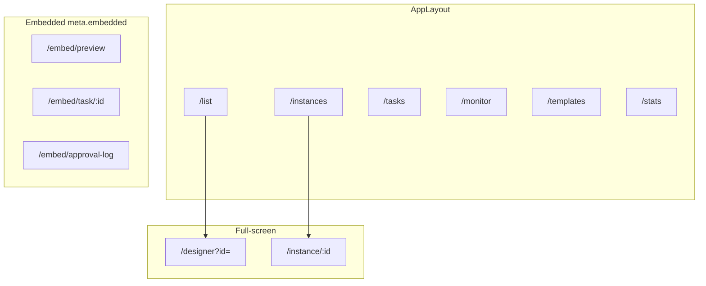
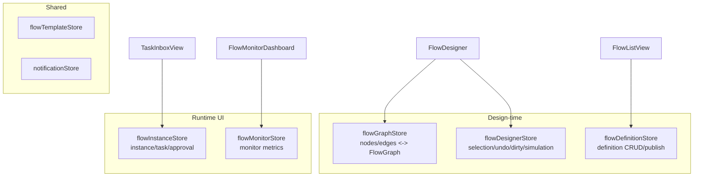
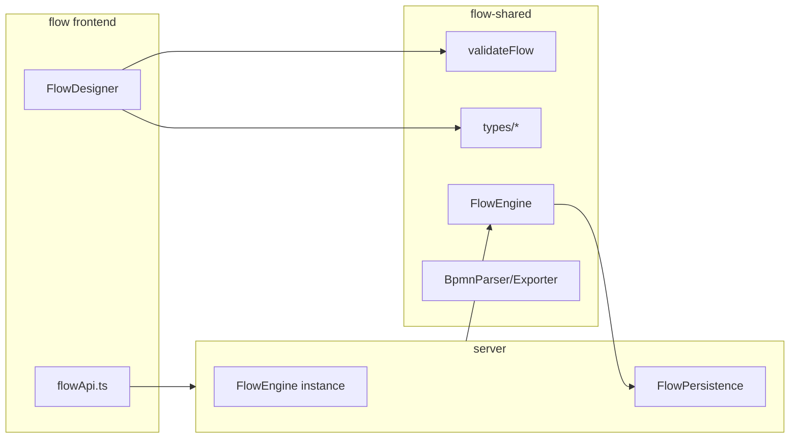

# Flow Information Architecture & Layout

## 1. App Shell

### 1.1 Standalone Mode

```
┌──────────────────────────────────────────────────────────────────────────┐
│ AppLayout                                                                │
├────────────┬─────────────────────────────────────────────────────────────┤
│ Sidebar    │  Main content                                               │
│            │                                                             │
│ Flow list  │                                                             │
│ Instances  │                                                             │
│ My tasks   │                                                             │
│ Monitor    │                                                             │
│ Templates  │                                                             │
│ Stats      │                                                             │
└────────────┴─────────────────────────────────────────────────────────────┘
```

### 1.2 Full-screen & Embedded

| Route | Layout | Use case |
|------|------|------|
| `/designer?id=` | Full-screen | BPMN designer |
| `/embed/preview` | No sidebar | Editor embedded flow preview |
| `/embed/task/:id` | No sidebar | Task approval embedded |
| `/embed/approval-log` | No sidebar | Approval log embedded |

qiankun sub-app name: `flow`, dev port **5200**.

---

## 2. Route Map



Embedded routes skip standalone auth and rely on the host token.

---

## 3. Store Relationships



---

## 4. flow-shared Boundary



**The frontend does not import FlowEngine**; only `validateFlow`, types, and BPMN import/export.

---

## 5. Editor / AI Integration

| Integration | Mechanism |
|--------|------|
| Editor | UserTask `formPublishId` -> iframe PublishView |
| Editor embed | `/embed/preview` polls `getExecutionState` |
| AI | iframe drawer + `onAiApply` writes to graph |
| Shell | qiankun + shared token |

See [designer.md](./designer.md), [runtime.md](./runtime.md).
