# Flow Runtime Architecture

> FlowEngine token model, server-side execution, frontend visualization - the design-time vs runtime boundary

---

## 1. Runtime Overview

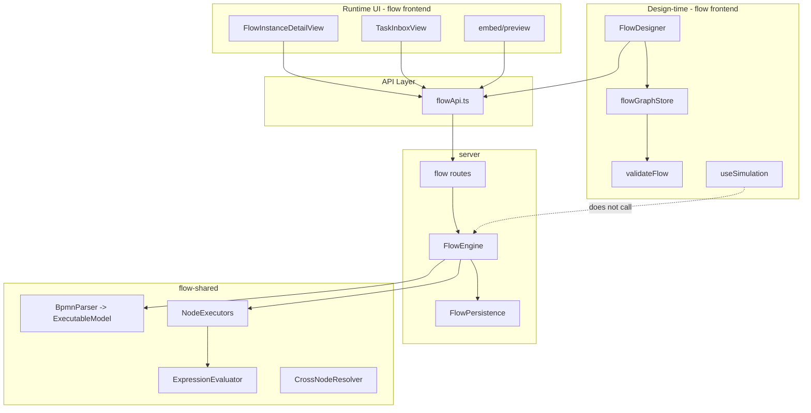

**Core principle**: `FlowEngine` runs only on the **server**; the frontend drives it via REST and visualizes state.

---

## 2. Design-time vs Runtime

| Dimension | Design-time | Runtime |
|------|--------|--------|
| Engine | `validateFlow` (client) | `FlowEngine` (server) |
| State | `flowGraph` nodes/edges | `FlowInstanceData` + tokens |
| Persistence | `FlowVersion.graph` | `FlowInstance` + `TaskInstance` |
| Simulation | `useSimulation` (simplified) | none (use real API) |
| Form | MicroFormEmbed preview | task form iframe |

---

## 3. FlowEngine Execution Model

### 3.1 Token State Machine

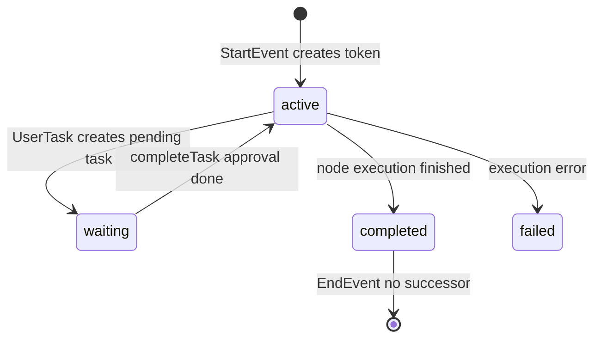

```typescript
interface FlowToken {
  id: string
  nodeId: string
  status: 'active' | 'waiting' | 'completed' | 'failed'
}
```

### 3.2 Start Instance

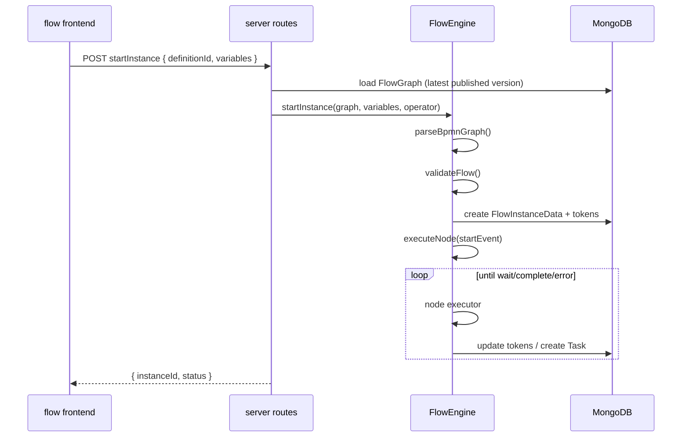

### 3.3 Node Executors

| BPMN type | Executor | Result |
|-----------|--------|------|
| StartEvent | StartEventExecutor | `continue` |
| EndEvent | EndEventExecutor | `complete` |
| UserTask | UserTaskExecutor | `wait` + Task |
| ExclusiveGateway | ExclusiveGatewayExecutor | conditional edge selection |
| ParallelGateway | ParallelGatewayExecutor | multiple tokens |
| ServiceTask | ServiceTaskExecutor | HTTP call |
| ScriptTask | ScriptTaskExecutor | expression execution |
| TimerEvent | TimerEventExecutor | timer/delay |
| SubProcess | SubProcessExecutor | sub-process |
| CallActivity | CallActivityExecutor | call external definition |

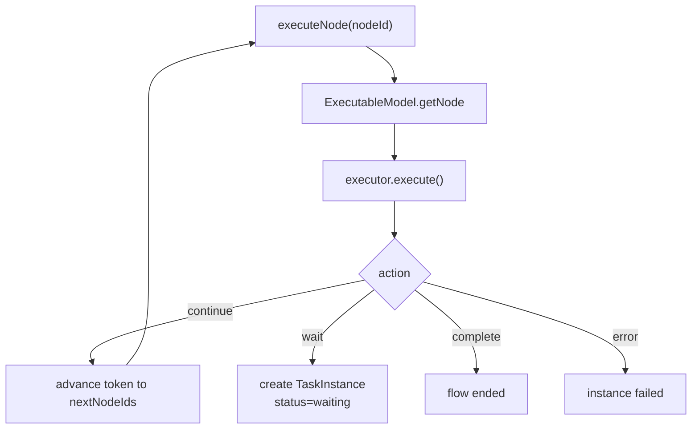

### 3.4 ExecutionContext

```typescript
interface ExecutionContext {
  instanceId: string
  variables: Record<string, unknown>      // process variables
  nodeFormData: Record<string, Record>      // nodeId -> form data
  operator?: string
  initiator?: string
}
```

Production uses the `variables` object; `VariableBus` exists only in test helpers.

---

## 4. UserTask Runtime

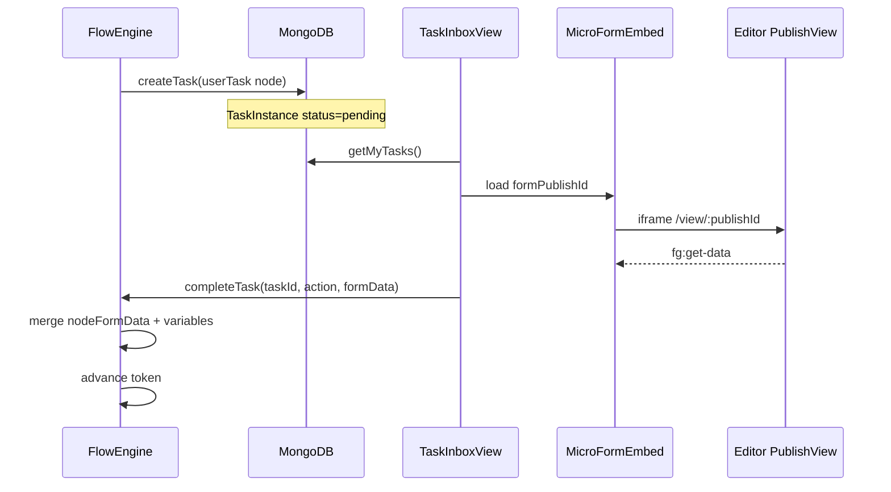

### Approval Action Runtime

| action | Engine behavior |
|--------|----------|
| approve | complete token, flow downstream |
| reject | `rejectToNode` roll back to specified node |
| delegate | change assignee, keep waiting |
| transfer | permanently change assignee |

---

## 5. Gateway Runtime

### ExclusiveGateway

```
evaluateExpression(condition, variables)
  -> pick first outgoing edge that satisfies
  -> if no match, use isDefault edge
```

### ParallelGateway

```
fork: create a token for each outgoing edge
join: wait for all incoming tokens to arrive, then merge
```

### InclusiveGateway

```
all satisfying outgoing edges get tokens (OR semantics)
```

**Designer simulation** simplifies the above and does not evaluate real expressions.

---

## 6. Expression Runtime

`ExpressionEvaluator.evaluateExpression()`:

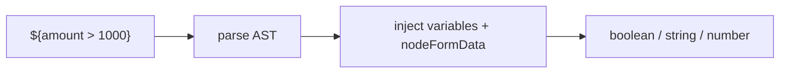

Used in: gateway conditions, assignee expressions, ScriptTask, ServiceTask param templates.

---

## 7. Cross-node Data Runtime

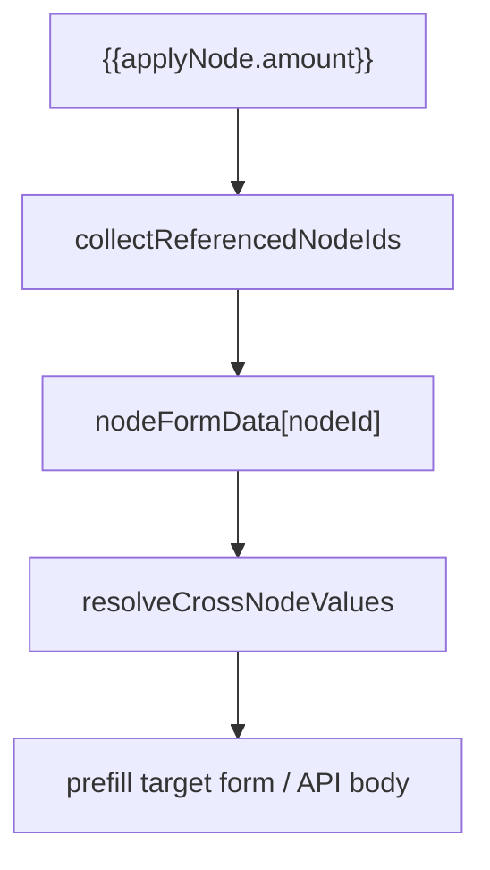

- **Server**: `CrossNodeResolver` (flow-shared)
- **Frontend**: `useCrossNodeData` + `getUpstreamNodeData` API

---

## 8. Frontend Visualization Runtime

### 8.1 Instance Graph State API

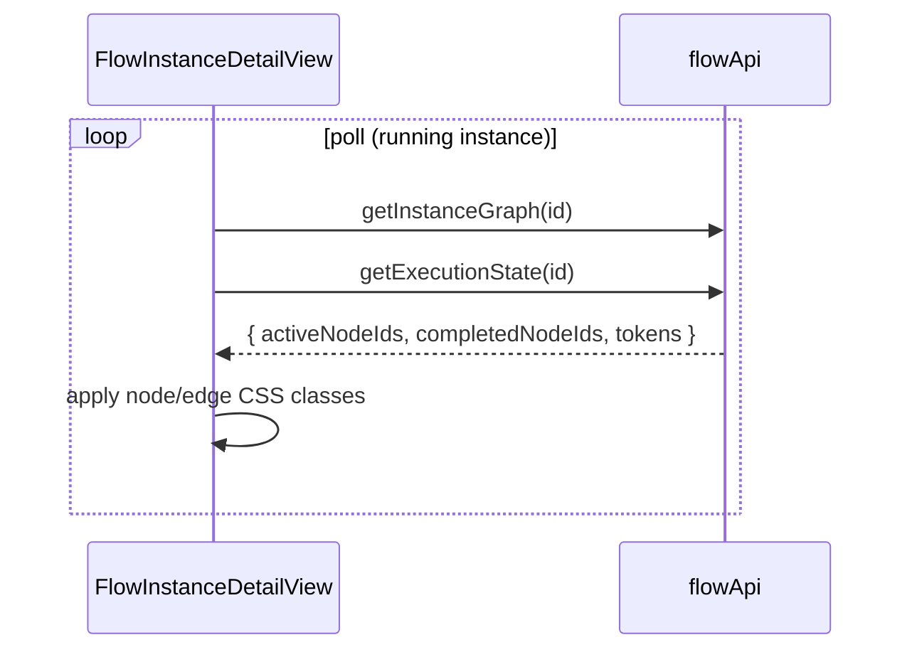

### 8.2 edgeRuntimeState

```
source completed + target active -> edge animated
node error -> edge error style
```

---

## 9. ServiceTask Runtime

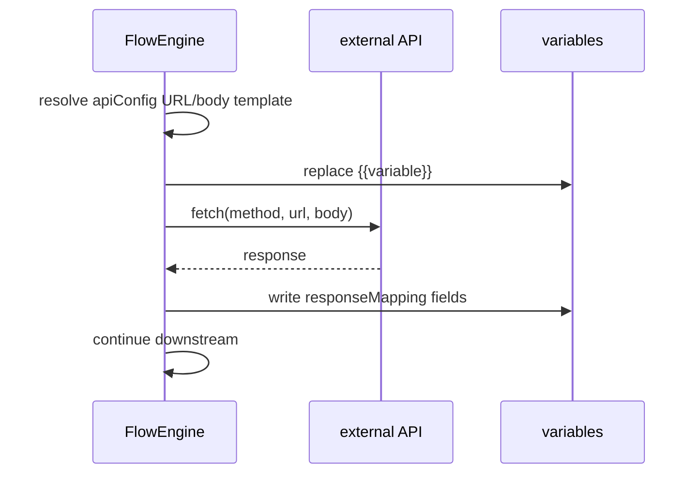

Design-time: `flowRequestQueue` prefetches API for designer preview (with TTL cache).

---

## 10. Monitor Runtime

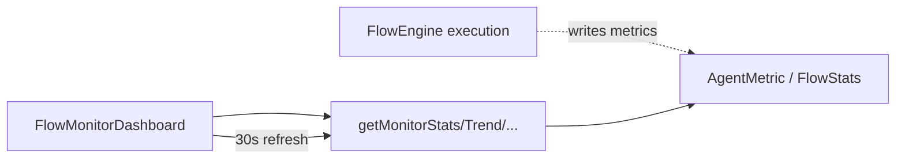

Monitoring data is decoupled from instance execution; used for aggregate stats.

---

## 11. AI Runtime Integration

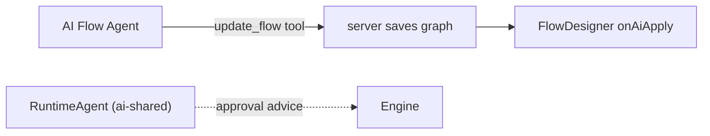

`RuntimeAgent` is called back by the engine via `onAIAssist` (when configured server-side).

---

## 12. Constraint Quick Reference

| Constraint | Description |
|------|------|
| Frontend does not import FlowEngine | server + flow-shared tests only |
| Simulation != execution | useSimulation does not call API |
| Published version executes | startInstance uses latest published |
| validateFlow both ends | before designer save + before engine start |
| 13/25 nodes | 13 UI types, engine executors extensible |

---

## Related Docs

- [designer.md](./designer.md) - designer interaction & simulation
- [instances-tasks.md](./instances-tasks.md) - task processing UI
- [../architecture.md](../architecture.md) - project architecture
- [../../flow-shared/src/engine/FlowEngine.ts](../../flow-shared/src/engine/FlowEngine.ts) - engine source
